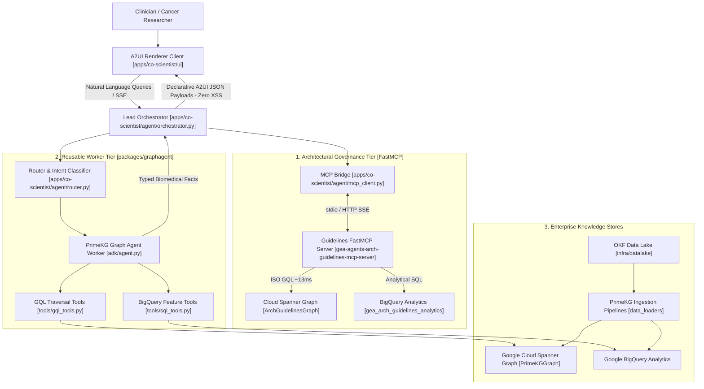

# GraphAgents Monorepo

> **Enterprise Multi-Agent Architecture for Biomedical Graph Intelligence & Precision Oncology**

[](https://www.python.org/)
[](https://github.com/jlowin/fastmcp)
[](https://cloud.google.com/spanner/docs/graph)
[](https://cloud.google.com/bigquery)
[](./apps/co-scientist/a2ui/catalog.json)

This monorepo contains reusable biomedical graph agent libraries (**Workers**) and full-stack agentic applications (**Orchestrators**). 

The platform implements a tiered architecture where a **Lead Orchestrator (Router)** synthesizes multi-step research plans, emits declarative **A2UI (Agent-to-UI)** payloads for safe client-side presentation, and delegates domain-specific graph queries to specialized **Graph Agent Workers** backed by **Google Cloud Spanner Graph** (PrimeKG) and **BigQuery**. 

All architectural decisions, design patterns, and security guardrails are continuously verified by the remote [Enterprise Agents Architectural Guidelines FastMCP Server](https://github.com/prdmohangoogley/gea-agents-arch-guidelines-mcp-server).

---

## 🏛️ System Architecture



---

## 📂 Monorepo Structure

```markdown
graphagents/ (cancer-co-scientist-reusable-graphagents-architectural-kgraph)
├── .agents/                    # 🚀 Antigravity Central Command
│   ├── mcp_config.json         # MCP server registration for Antigravity
│   ├── rules/
│   │   └── AGENTS.md           # Always-active guidelines (DOC-01, DOC-02, DOC-03, DOC-08, DOC-09)
│   └── skills/
│       └── guidelines_lookup/  # Reusable developer skill for architecture guidelines
│           ├── SKILL.md        # Skill frontmatter & execution documentation
│           ├── scripts/lookup.py # CLI tool to query Spanner Graph & BigQuery
│           └── references/guidelines_summary.md # Offline reference cheat sheet
├── specs/                     # 📋 Monorepo Specifications & Tracked Milestones
│   ├── README.md               # Spec tracking and governance guidelines
│   ├── 01-monorepo-phase1-scaffolding-and-global-standards.md
│   └── 02-architecture-guidelines-mcp-integration.md
├── docs/                       # 📖 Global Specs & OKF Guidelines
│   ├── README.md
│   ├── architecture.md         # Comprehensive multi-agent architecture
│   └── okf_guidelines.md       # PrimeKG & Open Knowledge Format standards
├── infra/                      # 🏗️ Global Infrastructure (Terraform)
│   ├── datalake/               # Core GCS (OKF Data Lake: raw, curated, embeddings)
│   └── primekg_staging/        # 🗄️ PrimeKG Staging & GCE Curl Pipelines
├── packages/                   # 🧩 REUSABLE PACKAGES & LIBRARIES
│   └── graphagent/             # Core Reusable Graph Agent Library (Worker Tier)
│       ├── adk/                # ADK definitions for PrimeKG traversal
│       │   ├── agent.py        # PrimeKGWorkerAgent headless reasoning
│       │   └── traversal.py    # Multi-hop biomedical path models
│       ├── tools/              # GQL/SQL Traversal & Querying tools
│       │   ├── gql_tools.py    # Cloud Spanner Graph ISO GQL tool
│       │   └── sql_tools.py    # BigQuery omics analytics & target scoring
│       ├── data_loaders/        # 🚚 PrimeKG Ingestion Pipelines
│       │   └── primekg_loader.py # Ingestion into Spanner Graph & BQ
│       └── iac/                # Package-specific IaC (Spanner + BigQuery)
│           ├── spanner.tf      # Cloud Spanner Graph DDL (Nodes, Edges, PrimeKGGraph)
│           └── bigquery.tf     # BigQuery datasets and embedding tables
└── apps/                       # 🌐 FULL-STACK APPLICATIONS
    └── co-scientist/           # 🩺 Cancer Co-Scientist Application (Orchestrator Tier)
        ├── a2ui/               # 🎨 A2UI Artifacts (DOC-03 Compliant)
        │   ├── catalog.json    # Declarative JSON schemas (Cards, Charts, Tables, Graphs)
        │   └── examples/       # Few-shot prompts and sample A2UI payloads
        ├── agent/              # 🧠 Lead Orchestrator, Router Logic
        │   ├── orchestrator.py # Main ADK Agent Loop emitting A2UI payloads
        │   ├── mcp_client.py   # Architecture Guidelines FastMCP Bridge
        │   └── router.py       # Intent classification & worker delegation
        ├── ui/                 # 💻 A2UI Renderer Client (TypeScript/Lit)
        │   ├── src/            # Pure declarative DOM renderer (Zero XSS)
        │   ├── package.json
        │   └── Dockerfile      # Non-root secure container (DOC-02 ZAA)
        └── iac/                # ☁️ Application Deployment IaC (Cloud Run)
            └── cloud_run.tf    # Cloud Run v2 orchestrator & UI services
```

---

## ⚡ Prerequisites & Mandatory Developer Setup

> [!IMPORTANT]
> **READ BEFORE DEVELOPING ANY AGENT**:  
> In order to develop, extend, or run agents in this project, **setting up the Enterprise Architecture Best Practices MCP Server is a mandatory prerequisite**.  
> The agent reasoning loops (`orchestrator.py`, `router.py`, and `graphagent`) dynamically query this MCP server to enforce Zero Ambient Authority (`DOC-02`), retrieve operational graph patterns from Cloud Spanner Graph, and guarantee declarative, non-executable A2UI compliance (`DOC-03`). Attempting to develop or test agents without this prerequisite will cause policy validation failures or fallback degradation.

### 🛑 Prerequisite 1: Deploy & Configure the Guidelines FastMCP Server

All architectural patterns, security guardrails, and data modeling standards are governed by the upstream repository:  
👉 **[https://github.com/prdmohangoogley/gea-agents-arch-guidelines-mcp-server](https://github.com/prdmohangoogley/gea-agents-arch-guidelines-mcp-server)**

To deploy this MCP server in your own Google Cloud project and wire it to Antigravity / IDE, complete the following steps:

#### Step 1.1: Clone the Guidelines MCP Server
```bash
git clone https://github.com/prdmohangoogley/gea-agents-arch-guidelines-mcp-server.git
cd gea-agents-arch-guidelines-mcp-server
uv sync
```

#### Step 1.2: Deploy Cloud Spanner Graph & BigQuery Infrastructure (Terraform)
The MCP server uses Cloud Spanner Graph (`ArchGuidelinesGraph`) for ISO GQL traversals and BigQuery (`gea_arch_guidelines_analytics`) for analytics and embeddings.
```bash
cd iac
cp terraform.tfvars.example terraform.tfvars

# Set your GCP Project ID in terraform.tfvars:
# project_id = "your-gcp-project-id"

terraform init
terraform plan
terraform apply
```
This provisions:
- **Cloud Spanner Instance**: `gea-arch-guidelines-spanner`
- **Spanner Graph Database**: `arch_guidelines_graph` with Property Graph DDL (`Nodes`, `Edges`, `ArchGuidelinesGraph`)
- **BigQuery Dataset**: `gea_arch_guidelines_analytics` (`guidelines`, `patterns`, `antipatterns`, `guideline_embeddings`)
#### Step 1.3: Acquire OKF Architecture Data & Dump into Your Own GCS Bucket
The authoritative Open Knowledge Format (**OKF**) corpus containing all 20 foundational architectural guidelines, concept specifications, schemas, and diagrams is hosted in Google Cloud Storage:
```text
gs://gea_agent_development_architectural_best_practices_1790796607/okf/
├── MANIFEST.json       # Corpus inventory with checksums and document counts (20 docs)
├── bundle.json         # Complete OKF manifest schema & topic taxonomies
├── index.md            # Master index of architectural best practices
├── log.md              # Ingestion changelog and provenance
├── concepts/           # 20 Enterprise Guidelines (01-ai-agent-quality-engineering.md through 20-*.md)
└── img/                # 73+ Architectural diagrams and visual blueprints
```

Developers must copy this knowledge bundle into their own project's bucket (or download it locally) to bootstrap their knowledge store:

```bash
# 1. Create your target knowledge base GCS bucket (if not using the one created by Terraform)
gcloud storage buckets create gs://YOUR_TARGET_BUCKET_NAME \
  --project=your-gcp-project-id \
  --location=us-central1 \
  --uniform-bucket-level-access

# 2. Dump/sync the entire OKF bundle directly from the source bucket to your own bucket
gcloud storage cp --recursive \
  gs://gea_agent_development_architectural_best_practices_1790796607/okf \
  gs://YOUR_TARGET_BUCKET_NAME/

# 3. (Optional) Download the OKF documents locally for local pipeline inspection
mkdir -p data/okf
gcloud storage cp --recursive \
  gs://gea_agent_development_architectural_best_practices_1790796607/okf \
  ./data/
```

#### Step 1.4: Run the Ingestion Pipeline (NL2KG)
Triplify the architectural corpus into Cloud Spanner Graph and BigQuery:
```bash
# Extract entities and relationships from local concepts or your synced bucket
uv run nl2kg-pipeline extract --source-dir ./data/okf/concepts/

# Validate extracted graph triples against ontology constraints
uv run nl2kg-pipeline validate --input-file build/graph/triples.json

# Commit nodes and edges to Cloud Spanner Graph & BigQuery
uv run nl2kg-pipeline load --project-id your-gcp-project-id
```

#### Step 1.5: Deploy the MCP Server (Local Stdio or Cloud Run SSE)

**Option A: Local Stdio Mode (Recommended for Development & Antigravity CLI)**  
Create a `.env` file in the MCP server directory:
```ini
GCP_PROJECT_ID=your-gcp-project-id
SPANNER_INSTANCE_ID=gea-arch-guidelines-spanner
SPANNER_DATABASE_ID=arch_guidelines_graph
BQ_DATASET_ID=gea_arch_guidelines_analytics
USE_MOCK_GRAPH=false
GOOGLE_APPLICATION_CREDENTIALS=/path/to/application_default_credentials.json
```
Verify the server starts:
```bash
uv run gea-mcp-server --transport stdio
```

**Option B: Cloud Run SSE Mode (for Shared Team Hosting)**
```bash
gcloud run deploy gea-arch-guidelines-mcp \
  --source . \
  --region us-central1 \
  --port 8080 \
  --set-env-vars "GCP_PROJECT_ID=your-gcp-project-id,SPANNER_INSTANCE_ID=gea-arch-guidelines-spanner,SPANNER_DATABASE_ID=arch_guidelines_graph,BQ_DATASET_ID=gea_arch_guidelines_analytics,USE_MOCK_GRAPH=false"
```

#### Step 1.6: Configure Antigravity MCP Integration
Configure Antigravity by adding the server to `~/.gemini/config/mcp_config.json` and `.agents/mcp_config.json`:
```json
{
  "mcpServers": {
    "gea-arch-guidelines": {
      "command": "uv",
      "args": [
        "--directory",
        "/path/to/gea-agents-arch-guidelines-mcp-server",
        "run",
        "gea-mcp-server",
        "--transport",
        "stdio"
      ],
      "env": {
        "GCP_PROJECT_ID": "your-gcp-project-id",
        "SPANNER_INSTANCE_ID": "gea-arch-guidelines-spanner",
        "SPANNER_DATABASE_ID": "arch_guidelines_graph",
        "BQ_DATASET_ID": "gea_arch_guidelines_analytics",
        "USE_MOCK_GRAPH": "false",
        "GOOGLE_APPLICATION_CREDENTIALS": "/path/to/application_default_credentials.json",
        "CLOUDSDK_CORE_PROJECT": "your-gcp-project-id"
      }
    }
  }
}
```

---

### 🛠️ Prerequisite 2: Developer Toolchain & Cloud Access
Ensure your workstation has the following installed and authenticated:
- **Python**: 3.11+
- **UV Package Manager**: `curl -LsSf https://astral.sh/uv/install.sh | sh`
- **Node.js**: 18+ & npm (for the A2UI client frontend)
- **Google Cloud SDK (`gcloud`)**: Authenticated with application-default credentials:
  ```bash
  gcloud auth application-default login
  gcloud config set project your-gcp-project-id
  ```
- **Terraform**: 1.5.0+ (for global infrastructure in `infra/` and package IaC)

---

### ✅ Prerequisite Verification: Live MCP Benchmarks
Before starting agent development, verify that your local environment connects live to **Cloud Spanner Graph** and **Google BigQuery**:

```bash
# 1. Verify Spanner Graph ISO GQL Invocation (~13ms latency)
python .agents/skills/guidelines_lookup/scripts/lookup.py --best-practice "security"

# 2. Verify BigQuery Analytics Deep Dive
python .agents/skills/guidelines_lookup/scripts/lookup.py --deep-dive "Quality"
```

If both commands return `Query Source: spanner_graph` and `Query Source: bigquery_analytics`, your environment is fully primed for agent development.

---

## 📊 Live Invocation Benchmarks & Performance Stats

The following benchmarks demonstrate live query execution across **Cloud Spanner Graph**, **BigQuery**, and the **Lead Orchestrator** against Google Cloud project `fivedaysai-prd-sandbox-317383`:

| Layer / Query Target | Storage Backend | Query Type | Live Latency | Status & Source |
| :--- | :--- | :--- | :--- | :--- |
| **`get_best_practice`** | Cloud Spanner Graph | ISO GQL Traversal | **13.76 ms** | `success` (`spanner_graph`) |
| **`deep_dive_guideline`** | Google BigQuery | Multi-Table SQL Join | **2128.03 ms** | `success` (`bigquery_analytics`) |
| **`process_clinical_inquiry`** | Orchestrator End-to-End | ADK + MCP + A2UI | **1915.53 ms** | `success` (`A2UI_SURFACE`) |

### Benchmark 1: Cloud Spanner Graph ISO GQL Invocation
Querying operational best practices and design patterns over `ArchGuidelinesGraph`:
```bash
python .agents/skills/guidelines_lookup/scripts/lookup.py --best-practice "security"
```
**Live Execution Output**:
```text
=== [MCP Tool: get_best_practice] ISO GQL Spanner Graph Query for: 'security' ===
Status:       success
Query Source: spanner_graph (Cloud Spanner Graph)
Latency:      13.76 ms
Total Matches:10
Patterns Verified from Spanner:
  - [PAT-1C192A] JIT Downscoped Credentials (DOC-02)
  - [PAT-1CA66F] Multimodal Rendered Artifact Evaluation
  - [PAT-2BF775] Correction Mining
  - [PAT-2C1A32] Defense-in-Depth Security Architecture
  - [PAT-37AEDE] Stateful Circuit Breaker with Git Checkpointing
  - [PAT-478ECE] Vibe Coding Agent Security
  - [PAT-48A855] ADK Trajectory Validation
  - [PAT-4FAEA3] Session-Prefix Rubric Derivation
  - [PAT-50CE20] Vibe Diff with Hardware MFA
```

### Benchmark 2: Google BigQuery Analytical Deep Dive
Querying pattern implementations, antipattern hazards, and remedies over BigQuery:
```bash
python .agents/skills/guidelines_lookup/scripts/lookup.py --deep-dive "Quality"
```
**Live Execution Output**:
```text
=== [MCP Tool: deep_dive_guideline] BigQuery Analytics Query for: 'Quality' ===
Status:       success
Query Source: bigquery_analytics (Google BigQuery)
Latency:      2128.03 ms
Patterns Implemented:
  - Quality Scorecard as Executable Release Gate (DOC-01)
  - Evaluatable-by-Design Instrumentation
  - Model Routing to Resolve Effectiveness-Efficiency Tension
  - Black Box Golden Dataset Regression
  - Black Box Metric Selection
  - Glass Box Trajectory Assertion
  - Runtime Precondition Enforcement
  - Calibrated LLM Judge
  - Bias Mitigation in Pairwise Evaluation
```

### Benchmark 3: Lead Orchestrator End-to-End Execution
The Orchestrator queries Spanner Graph via FastMCP, evaluates clinical intent, queries Graph Workers, and emits a validated A2UI surface:
```bash
uv run python -c "
import asyncio
from agent.orchestrator import CancerCoScientistOrchestrator

async def run():
    orch = CancerCoScientistOrchestrator(use_mock=False)
    payload = await orch.process_clinical_inquiry('What are targeted therapeutics for EGFR in lung cancer?')
    print('Surface ID:', payload['surface_id'])
    print('Components Emitted:', [c['component'] for c in payload['components']])
    print('Governance Metadata:', payload['governance_metadata'])

asyncio.run(run())
"
```
**Live Execution Output**:
```python
Surface ID: surf_16f2304c
Components Emitted: ['InsightCard', 'KnowledgeGraphView']
Governance Metadata: {
  'spanner_graph_source': 'spanner_graph',
  'spanner_graph_latency_ms': 13.9,
  'bigquery_analytics_source': 'bigquery_analytics',
  'bigquery_latency_ms': 1901.63,
  'patterns_verified': [
    'JIT Downscoped Credentials', 
    'Multimodal Rendered Artifact Evaluation', 
    'Correction Mining'
  ]
}
```

---

## 🎨 Declarative A2UI Protocol Standards (DOC-03)

Under **DOC-03** (*Open AI Agent Protocol Stack*), presentation logic is strictly decoupled from LLM inference:
- **Zero Raw HTML/JS Injection**: The model emits non-executable JSON schemas validated against [`apps/co-scientist/a2ui/catalog.json`](./apps/co-scientist/a2ui/catalog.json).
- **Client Design System Rendering**: The frontend parses structured component objects (`InsightCard`, `KnowledgeGraphView`, `PathwayChart`, `DrugRepurposingTable`, `EvidenceDrawer`) and mounts them securely into DOM nodes without `eval()` or `innerHTML`.

### Example A2UI Payload Structure
```json
{
  "type": "A2UI_SURFACE",
  "surface_id": "surf_cancer_discovery_7157",
  "intent": "TARGET_VALIDATION",
  "components": [
    {
      "component": "InsightCard",
      "id": "card_tp53_insight",
      "props": {
        "title": "TP53 Pathway Dysregulation in High-Grade Serous Ovarian Carcinoma",
        "severity": "critical",
        "summary": "Loss-of-function mutation confers synthetic lethality with PARP inhibition.",
        "confidence_score": 0.99,
        "tags": ["Ovarian Cancer", "TP53", "Synthetic Lethality"]
      }
    },
    {
      "component": "KnowledgeGraphView",
      "id": "kg_tp53_subgraph",
      "props": {
        "layout": "force-directed",
        "nodes": [
          { "id": "NCBI:7157", "label": "Gene", "name": "TP53" },
          { "id": "MONDO:0008170", "label": "Disease", "name": "Ovarian Carcinoma" },
          { "id": "DRUGBANK:DB09074", "label": "Drug", "name": "Olaparib" }
        ],
        "edges": [
          { "source_id": "NCBI:7157", "target_id": "MONDO:0008170", "relationship": "ASSOCIATED_WITH", "confidence": 0.99 },
          { "source_id": "DRUGBANK:DB09074", "target_id": "NCBI:7157", "relationship": "TARGETS", "confidence": 0.97 }
        ]
      }
    }
  ],
  "guidelines_cited": ["DOC-03", "DOC-02"]
}
```

---

## 🚀 Quickstart & Development

### 1. Workspace Installation
```bash
# Clone the repository
git clone <repo-url>
cd cancer-co-scientist-reusable-graphagents-architectural-kgraph

# Install dependencies across all workspace packages
uv sync
```

### 2. Running the Cancer Co-Scientist Web Application
```bash
# Terminal 1: Start the Lead Orchestrator backend (Port 8000)
uv run uvicorn apps.co_scientist.agent.orchestrator:app --reload --port 8000

# Terminal 2: Start the A2UI client frontend (Port 5173)
cd apps/co-scientist/ui
npm install
npm run dev
```
Navigate to `http://localhost:5173` to explore cancer targets and drug candidates interactively.

---

## 🛡️ Global Architectural Invariants
All code, models, and specifications in this monorepo adhere strictly to:
1. **Layer Separation (DOC-03)**: Tool execution (MCP / Spanner GQL), agent orchestration (Router / ADK), presentation (A2UI), and data storage (Spanner Graph & BigQuery) are strictly segregated.
2. **Declarative Non-Executable A2UI (DOC-03)**: Eliminates XSS and prompt injection by emitting only structured JSON component schemas.
3. **Zero Ambient Authority (DOC-02)**: Workload Identity Federation and least-privilege IAM roles defined across all Terraform files with non-root Docker execution (`USER 101`).
4. **Parameterized ISO GQL (DOC-09)**: All graph traversals against Cloud Spanner Graph are parameterized to prevent injection and maximize plan caching.
