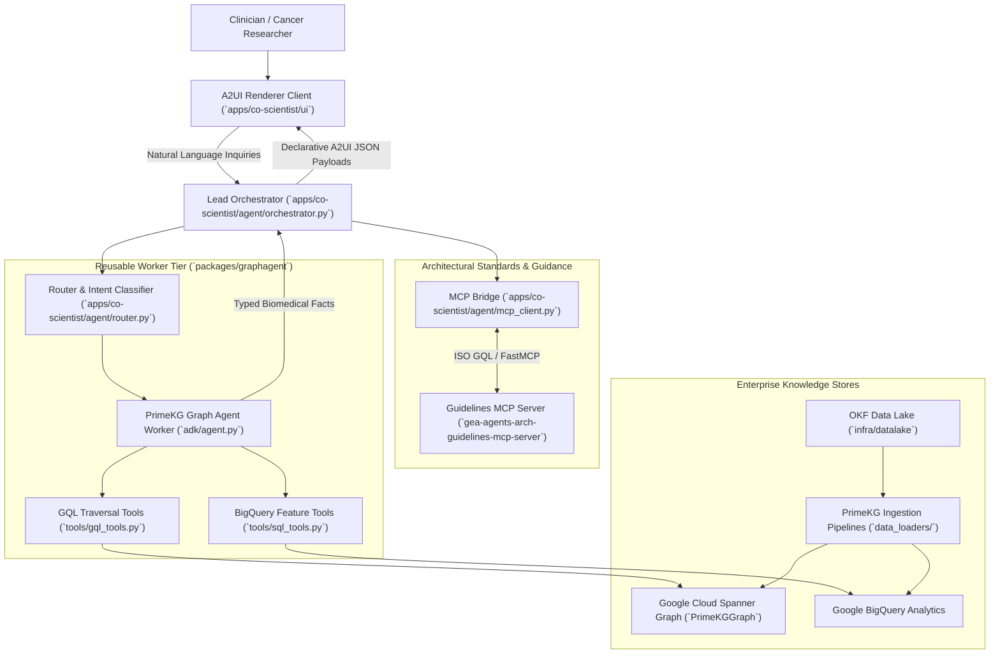

# GraphAgents Monorepo

> **Enterprise Multi-Agent Architecture for Biomedical Graph Intelligence and Cancer Discovery**

This monorepo contains reusable graph agent libraries (**Workers**) and full-stack agentic applications (**Orchestrators**). 

The system implements a tiered architecture where a **Lead Orchestrator (Router)** synthesizes multi-step research plans, emits declarative **A2UI (Agent-to-UI)** payloads for safe and responsive frontend rendering, and delegates domain-specific graph queries to specialized **Graph Agent Workers** backed by **Google Cloud Spanner Graph** and **BigQuery**. All architectural decisions and design patterns are continuously guided and verified by the remote [Architectural Guidelines FastMCP Server](https://github.com/prdmohangoogley/gea-agents-arch-guidelines-mcp-server).

---

## 🏛️ System Architecture



---

## 📂 Monorepo Structure

```markdown
graphagents/ (cancer-co-scientist-reusable-graphagents-architectural-kgraph)
├── .agents/                    # 🚀 Antigravity Central Command
│   ├── rules/                 # Always-active guidelines (AGENTS.md)
│   └── skills/                # Reusable developer skills (guidelines_lookup)
├── specs/                     # 📋 Monorepo Specifications & Tracked Milestones
│   ├── 01-monorepo-phase1-scaffolding-and-global-standards.md
│   └── 02-architecture-guidelines-mcp-integration.md
├── docs/                       # 📖 Global Specs & OKF Guidelines
│   ├── architecture.md        # Comprehensive multi-agent architecture
│   └── okf_guidelines.md      # Ontology Knowledge Framework standards
├── infra/                      # 🏗️ Global Infrastructure (Terraform)
│   ├── datalake/              # Core GCS (OKF Data Lake)
│   └── primekg_staging/       # 🗄️ PrimeKG Staging & GCE Curl Pipelines
├── packages/                   # 🧩 REUSABLE PACKAGES & LIBRARIES
│   └── graphagent/            # Core Reusable Graph Agent Library (Worker Tier)
│       ├── adk/               # ADK definitions for PrimeKG traversal
│       ├── tools/             # GQL/SQL Traversal & Querying tools
│       ├── data_loaders/       # 🚚 PrimeKG Ingestion Pipelines
│       └── iac/               # Package-specific IaC (Spanner + BQ)
└── apps/                       # 🌐 FULL-STACK APPLICATIONS
    └── co-scientist/          # 🩺 Cancer Co-Scientist Application (Orchestrator Tier)
        ├── a2ui/              # 🎨 A2UI Artifacts (Catalog, Examples)
        │   ├── catalog.json   # Component definitions (Cards, Charts, etc.)
        │   └── examples/      # Few-shot prompts for UI generation
        ├── agent/             # 🧠 Lead Orchestrator, Router Logic
        │   ├── orchestrator.py# Main ADK Agent Loop
        │   ├── mcp_client.py   # Architecture Guidelines MCP Bridge
        │   └── router.py      # Intent Classification & Delegation
        ├── ui/                # 💻 A2UI Renderer Client (TypeScript/Lit)
        │   ├── src/
        │   ├── package.json
        │   └── Dockerfile
        └── iac/               # ☁️ Application Deployment IaC (Cloud Run)
```

---

## ⚡ Quickstart

### Prerequisites
- Python 3.11+
- [uv](https://github.com/astral-sh/uv) package manager
- Node.js 18+ (for UI client)
- Google Cloud SDK (`gcloud`) & Terraform 1.5+

### Installation
```bash
# Clone the repository
git clone <repo-url>
cd cancer-co-scientist-reusable-graphagents-architectural-kgraph

# Install dependencies across all workspace packages
uv sync
```

### Querying Architecture Guidelines
To consult the FastMCP guidelines server:
```bash
python .agents/skills/guidelines_lookup/scripts/lookup.py --query "a2ui"
```

---

## 🛡️ Global Architectural Standards
All code and specifications in this repository are governed by the following core architectural invariants:
1. **Layer Separation**: Tool execution (MCP), agent federation (A2A), and presentation (A2UI) must never be blended.
2. **Declarative Non-Executable UI (A2UI)**: Agents must never emit raw HTML, JavaScript, or executable widgets. All UI outputs conform to schemas in `apps/co-scientist/a2ui/catalog.json`.
3. **Zero Ambient Authority (ZAA)**: Services and agents operate under explicit, least-privilege identity without inherited broad tokens.
4. **Parameterized ISO GQL**: All graph traversals against Cloud Spanner Graph are parameterized to prevent injection and maximize plan caching.
