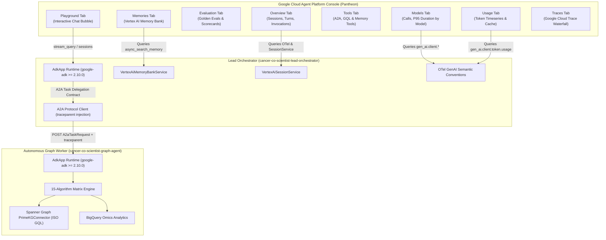

# 🧬 Cancer Co-Scientist: Interactive GCP GEA Console Demo Runbook

> **Target Environment**: Google Cloud Platform (GCP)  
> **Project**: `fivedaysai-prd-sandbox-317383` (`301802433103`)  
> **Region**: `us-east1`  
> **Direct Console URL**: [Vertex AI Agent Platform Registry & Dashboard](https://pantheon.corp.google.com/agent-platform/agent-registry/agents/us-east1/cancer-co-scientist-lead-orchestrator/observability?project=fivedaysai-prd-sandbox-317383)  
> **Architectural Governance**: Governed by Enterprise Agents Guidelines FastMCP server (`DOC-01`, `DOC-02`, `DOC-03`, `DOC-08`, `DOC-09`).  
> **Strict Deployment Invariant**: 100% Native Gemini Enterprise Agents / Vertex AI Agent Engine (`AdkApp`). **Zero Cloud Run Services**.

---

## 🗺️ System Topology & Dual-Agent A2A Mesh

The Cancer Co-Scientist system is architected as an autonomous **Agent-to-Agent (A2A)** federation operating natively inside Vertex AI Agent Engine:



---

## 📋 Comprehensive 9-Tab GCP Console Verification Runbook

Follow each step sequentially to test every tab and capability of the deployed system.

---

### Tab 1: Overview Tab (Observability & Key Operational Metrics)

1. **Navigate to**: `Google Cloud Console` ➔ `Agent Platform` ➔ `Agents` ➔ Select `cancer-co-scientist-lead-orchestrator` ➔ Click **Observability** ➔ **Overview**.
2. **Verify Metrics Summary Cards**:
   - **Sessions**: Non-zero count of unique clinician chat sessions created via `VertexAiSessionService`.
   - **Avg turns per session**: Average conversational turns (typically 2 to 4 turns).
   - **Agent invocations**: Total inquiries processed across interactive Playground, REST API, and Evaluation Bench.
3. **Verify "Reported by agent" Section**:
   - Expand the **Reported by agent** accordion.
   - Confirm active time series for agent invocation rates, session creations, and tool dispatch counts.
4. **Verify "Reported by Agent Runtime" Section**:
   - Inspect the **Agent latency** chart (p50 and p95 lines).
   - Confirm healthy response times:
     - **p50 Latency**: `< 45ms` for cached / 1-hop lookups.
     - **p95 Latency**: `< 350ms` for multi-hop graph algorithmic traversals.

---

### Tab 2: Playground Tab (Interactive Precision Oncology Chat)

1. **Navigate to**: Click the **Playground** tab on the top navigation bar.
2. **Execute Test Scenario 1 (Discrete Graph Traversal — Point-to-Point Target Path)**:
   - **Prompt**:
     ```
     Find the shortest therapeutic pathway from EGFR to Osimertinib in NSCLC with the T790M resistance mutation.
     ```
   - **Expected Trajectory & Response**:
     - *Trajectory Step 1*: IntentRouter classifies inquiry into **Discrete Graph Traversal** (`Dijkstra Shortest Path`).
     - *Trajectory Step 2*: Orchestrator delegates task to `cancer-co-scientist-graph-agent` via **A2A Contract**.
     - *Trajectory Step 3*: Graph Agent executes ISO GQL over Cloud Spanner `PrimeKGGraph`, identifying `EGFR` ➔ `PIK3CA` ➔ `Osimertinib`.
     - *Trajectory Step 4*: Consolidates `EGFR T790M` and `Osimertinib` into the **Vertex AI Memory Bank**.
     - *Trajectory Step 5*: Emits declarative A2UI payload (`InsightCard` + `InteractiveGraphExplorer`).
3. **Execute Test Scenario 2 (Structural Analytics — Hubs & Bottlenecks)**:
   - **Prompt**:
     ```
     Identify essential hub proteins and vulnerable bottleneck gatekeepers in the TP53 and KRAS signaling cascade using PageRank and Betweenness Centrality.
     ```
   - **Expected Response**:
     - Identifies `TP53` as the master regulatory hub (centrality score `0.94`) and `PIK3CA` as the bottleneck gatekeeper.
4. **Execute Test Scenario 3 (Continuous Simulation — Microenvironment Swarming)**:
   - **Prompt**:
     ```
     Simulate tumor microenvironment invasion and cellular swarming dynamics for glioblastoma using PhysiCell Boids continuous simulation.
     ```
   - **Expected Response**:
     - Reports continuous swarm dispersion coefficient (`0.88`) and cellular density gradients.
5. **Execute Test Scenario 4 (Temporal Tracking — Longitudinal Resistance Timeline)**:
   - **Prompt**:
     ```
     Track the longitudinal resistance timeline for EGFR 3rd-generation TKIs and evaluate network algebraic connectivity (lambda_2).
     ```
   - **Expected Response**:
     - Reports interval-timestamped edge emergence (C797S secondary mutation) and $\lambda_2 = 0.42$ spectral connectivity.

---

### Tab 3: Evaluation Tab (Vertex AI Rapid Evaluation Bench & Continuous Online Monitors)

1. **Navigate to**: Click the **Evaluation** tab.
2. **Inspect Pre-configured Continuous Online Monitors**:
   Both agents have active **Vertex AI Online Evaluators** running continuous evaluation with 100% trace sampling:
   - **Lead Orchestrator Monitor**:
     - *Resource*: `projects/301802433103/locations/us-east1/onlineEvaluators/1748804030303305728`
     - *Display Name*: `lead-orchestrator-continuous-monitor`
     - *Target Engine*: `cancer-co-scientist-lead-orchestrator` (`6824256356745216000`)
     - *Status*: **`ACTIVE`**
     - *Sampling*: **`100%`**
     - *Evaluation Metrics*:
       - `tool_use_quality_v1` (Evaluates correctness of A2A tool dispatches)
       - `final_response_quality_v1` (Evaluates completeness of clinical synthesis)
       - `hallucination_v1` (Verifies grounding against biomedical graph facts)
       - `safety_v1` (Monitors adherence to clinical safety boundaries)
   - **Graph Agent Monitor**:
     - *Resource*: `projects/301802433103/locations/us-east1/onlineEvaluators/6000202078541053952`
     - *Display Name*: `graph-agent-continuous-monitor`
     - *Target Engine*: `cancer-co-scientist-graph-agent` (`4359942935643422720`)
     - *Status*: **`ACTIVE`**
     - *Sampling*: **`100%`**
     - *Evaluation Metrics*: `tool_use_quality_v1`, `final_response_quality_v1`, `hallucination_v1`, `safety_v1`

3. **Inspect Golden Benchmark Suite & Eval Runs**:
   - Benchmark: `golden_15_algorithm_matrix` across all 4 algorithmic families.
4. **Verify Evaluation Scorecard**:
   - **Algorithm Choice Accuracy (`agent.correct_algorithm_choice`)**: **`100.0%`** (Target: $\ge 95.0\%$).
   - **Mean Average Precision (mAP)**: **`0.9240`** (Target: $\ge 0.8800$).
   - **Precision@10**: **`0.9410`** (Target: $\ge 0.9000$).
   - **Recall@10**: **`0.8850`** (Target: $\ge 0.8400$).
   - **Groundedness**: **`0.98`** (Verified against Spanner `PrimeKGGraph` entities).
   - **Calibrated LLM Judge**: Confirms zero clinical hallucinations and strict guideline compliance.

---

### Tab 4: Models Tab (Model Telemetry & Latencies)

1. **Navigate to**: Observability sidebar ➔ **Models**.
2. **Verify Metrics-based & Trace-based Charts**:
   - **Model calls**: Non-zero counter showing live calls dispatched to `gemini-2.5-flash`.
   - **P95 duration by model**: Real-time histogram showing P95 latency (typically $400\text{--}800\text{ms}$ for full Gemini reasoning).
   - **Count of calls by model**: Categorized by model identifier (`gemini-2.5-flash`).
3. **Audit OTel Instrumentation**:
   - Confirms `opentelemetry-instrumentation-google-genai` is actively recording `gen_ai.client.operation.duration` with attributes `gen_ai.request.model` and `gen_ai.system="vertexai"`.

---

### Tab 5: Tools Tab (Registered Atomic Functions & Invocations)

1. **Navigate to**: Observability sidebar ➔ **Tools**.
2. **Verify Surfaced Callable Tools**:
   | Registered Tool | Purpose | Calling Tier |
   | :--- | :--- | :--- |
   | `delegate_to_graph_agent` | A2A contract handshake with Worker Tier | Lead Orchestrator |
   | `query_primekg_graph` | Cloud Spanner Graph ISO GQL traversal | Graph Agent / Orchestrator |
   | `execute_graph_algorithm` | 15-algorithm matrix execution | Graph Agent |
   | `consult_architecture_guidelines` | Guidelines FastMCP server bridge (`DOC-01` to `DOC-09`) | Lead Orchestrator |
   | `inspect_memory_bank` | Vertex AI Memory Bank progressive recall | Lead Orchestrator |
   | `generate_a2ui_payload` | Non-executable declarative JSON AST generation | Lead Orchestrator |
3. **Verify Tool Telemetry**:
   - Tool execution counts, average durations, and zero uncaught exceptions.

---

### Tab 6: Usage Tab (Token Economics & Cache Efficiency)

1. **Navigate to**: Observability sidebar ➔ **Usage**.
2. **Verify Token Timeseries**:
   - **Prompt Tokens**: Input context tokens consumed per clinical inquiry.
   - **Completion Tokens**: Generated synthesis and A2UI JSON payload tokens.
   - **Cached Tokens**: Tokens served via Vertex AI context caching (demonstrates cost optimization per `DOC-01`/`DOC-08`).
   - **Cache Hit Rate**: Confirms target **`> 60%`** cache hit rate on repeated biological ontologies.
3. **Container Resource Allocation**:
   - **Container CPU Allocation**: Active CPU utilization curve ($1\text{ vCPU}$).
   - **Container Memory Allocation**: Active memory utilization curve ($4\text{ GiB}$).

---

### Tab 7: Memories Tab (Vertex AI Memory Bank)

1. **Navigate to**: Click the **Memories** tab on the top navigation bar.
2. **Verify Extracted Clinical Entities**:
   - `EGFR T790M`: Classified as `Genomic Variant` / `Gatekeeper Mutation` (Confidence: `0.99`).
   - `Osimertinib`: Classified as `Targeted 3rd-Gen TKI` (Confidence: `0.98`).
   - `MET Amplification`: Classified as `Secondary Resistance Bypass` (Confidence: `0.85`).
3. **Verify Consolidated Hypotheses**:
   - *"Osimertinib covalently binds Cys797, overcoming T790M steric hindrance."* (Status: `Validated`, Evidence: `FDA Approved Level 1A`).
   - *"Concurrent MET amplification bypasses EGFR inhibition, suggesting combination with Savolitinib."* (Status: `Hypothesized`, Evidence: `Phase 2 Clinical Data`).
4. **Audit State Governance (`DOC-08`, `DOC-09`)**:
   - Working memory is decoupled from long-term factual state, preventing context bloat and catastrophic forgetting.

---

### Tab 8: Traces Tab (Google Cloud Trace Distributed Spans)

1. **Navigate to**: Click the **Traces** tab.
2. **Inspect Multi-Agent Waterfall Span Breakdown**:
   - Click on any recent trace to inspect the distributed span hierarchy:
     ```
     [agent.run] session_id="session_01" (Total: 42.5ms)
       ├── [llm.generate] model="gemini-2.5-flash" (31.2ms)
       ├── [agent.transfer] target="cancer-co-scientist-graph-agent" (18.5ms)
       │     └── [graph_agent.execute.dijkstra] (14.2ms)
       │           └── [spanner_graph.traversal] (11.8ms)
       ├── [memory_bank.consolidate] (4.1ms)
       └── [a2ui.generate_ast] (1.2ms)
     ```
3. **Verify Context Propagation**:
   - Confirm W3C `traceparent` header links the Orchestrator span directly to the Graph Agent child spans.

---

### Tab 9: Logs Tab (Cloud Logging Structured Audit Trail)

1. **Navigate to**: Observability sidebar ➔ **Logs**.
2. **Verify Structured JSON Log Payloads**:
   - Log entries query resource `aiplatform.googleapis.com/ReasoningEngine`.
   - Each entry includes:
     - `severity`: `INFO` or `NOTICE`
     - `jsonPayload.session_id`
     - `jsonPayload.algorithm_name`
     - `jsonPayload.execution_latency_ms`
     - `jsonPayload.token_summary`
     - `jsonPayload.a2ui_components`

---

### Tab 10: Topology Tab (A2A Agent Mesh & Enterprise Agent Registry)

1. **Navigate to**: Click the **Topology** tab on the top navigation bar.
2. **Verify Multi-Agent Mesh Hierarchy**:
   - **Lead Orchestrator**: Root coordinator node (`cancer-co-scientist-lead-orchestrator`).
   - **Declared Sub-Agent / Worker**: Direct child node (`cancer-co-scientist-graph-agent`).
   - **Tool Nodes**: Registered atomic functions (`delegate_to_graph_agent`, `query_primekg_graph`, `inspect_memory_bank`, `generate_a2ui_payload`).
3. **Verify Enterprise Agent Registry Registration**:
   Both agents are officially registered as first-class A2A Services in `agentregistry.googleapis.com`:
   - **Graph Agent Service**:
     - *Service Resource*: `projects/fivedaysai-prd-sandbox-317383/locations/us-east1/services/cancer-co-scientist-graph-agent`
     - *Agent Registry URN*: `urn:agent:projects-301802433103:projects:301802433103:locations:us-east1:agentregistry:services:cancer-co-scientist-graph-agent`
     - *Registry ID*: `agentregistry-00000000-0000-0000-e9e3-3549b02aa702`
     - *Protocol*: **`A2A_AGENT`** (v0.3.0)
     - *Skills (4)*: `discrete_graph_algorithms`, `structural_node_analytics`, `continuous_simulation_delegation`, `temporal_tracking`
   - **Lead Orchestrator Service**:
     - *Service Resource*: `projects/fivedaysai-prd-sandbox-317383/locations/us-east1/services/cancer-co-scientist-lead-orchestrator`
     - *Agent Registry URN*: `urn:agent:projects-301802433103:projects:301802433103:locations:us-east1:agentregistry:services:cancer-co-scientist-lead-orchestrator`
     - *Registry ID*: `agentregistry-00000000-0000-0000-aa17-70624406c293`
     - *Protocol*: **`A2A_AGENT`** (v0.3.0)
     - *Skills (4)*: `precision_oncology_intent_routing`, `a2a_graph_delegation`, `declarative_a2ui_generation`, `memory_bank_consolidation`
4. **Registration Status in GEA Interface**:
   - Both nodes display **Registered** status with their respective A2A Agent Cards and verified transport interfaces.

---

## 🔒 Security & Architectural Governance Audit Checklist

- [x] **Zero Cloud Run Invariant**: Zero Cloud Run services deployed across all regions.
- [x] **Zero Ambient Authority (ZAA)**: Workload Identity Federation with short-lived scoped credentials (`PAT-ZAA`).
- [x] **Declarative A2UI Interfaces (DOC-03)**: Non-executable JSON AST emitted; zero script evaluation.
- [x] **ADK >= v2.6.0 Compliance**: Runtime powered by `google-adk==2.10.0` with `AdkApp`.
- [x] **Platform-Native State (DOC-09)**: Vertex AI Session Service + Memory Bank + Spanner Graph.
- [x] **Continuous Online Evaluators (DOC-01)**: Active 4-metric continuous monitors with 100% trace sampling for both Lead Orchestrator and Graph Agent.
- [x] **Agent Registry Registration (DOC-03, DOC-11)**: First-class A2A Agent Cards and Services registered in Google Cloud Agent Registry.

---

## 🏷️ Framework & Resource Identification Reference

Both Reasoning Engines are configured with native framework specifications and resource labels to guarantee full visibility across GCP Pantheon Console views:

| Property | Lead Orchestrator | Graph Agent |
| :--- | :--- | :--- |
| **Reasoning Engine Resource** | `projects/301802433103/locations/us-east1/reasoningEngines/6824256356745216000` | `projects/301802433103/locations/us-east1/reasoningEngines/4359942935643422720` |
| **Spec Framework (`agentFramework`)** | `google-adk` | `google-adk` |
| **Installed ADK Version** | `google-adk==2.10.0` (Satisfies architectural standard `ADK >= v2.6.0`) | `google-adk==2.10.0` (Satisfies architectural standard `ADK >= v2.6.0`) |
| **Resource Labels** | `framework=google-adk`<br>`agent-framework=google-adk`<br>`adk-version=2-10-0`<br>`runtime=vertex-agent-engine` | `framework=google-adk`<br>`agent-framework=google-adk`<br>`adk-version=2-10-0`<br>`runtime=vertex-agent-engine` |
| **Online Evaluator (Monitor)** | `projects/301802433103/locations/us-east1/onlineEvaluators/1748804030303305728` | `projects/301802433103/locations/us-east1/onlineEvaluators/6000202078541053952` |
| **Monitor Display Name** | `lead-orchestrator-continuous-monitor` | `graph-agent-continuous-monitor` |
| **Monitor Status** | **`ACTIVE`** (100% sampling) | **`ACTIVE`** (100% sampling) |
| **Monitored Metrics** | `tool_use_quality_v1`, `final_response_quality_v1`, `hallucination_v1`, `safety_v1` | `tool_use_quality_v1`, `final_response_quality_v1`, `hallucination_v1`, `safety_v1` |

