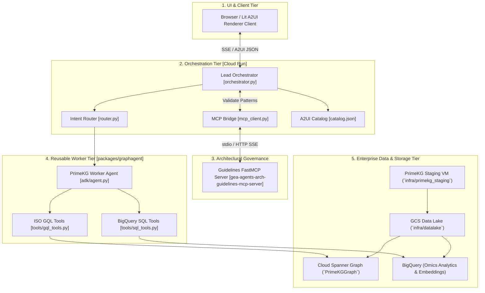

# System Architecture: GraphAgents & Cancer Co-Scientist

## 1. System Overview
The `graphagents` monorepo implements a multi-agent biomedical platform that bridges multi-omics knowledge graphs with interactive clinical decision support.

The system is structured as a **Hierarchical Multi-Agent Mesh**:
- **Front-End & Presentation**: Native UI clients consume declarative **A2UI (Agent-to-UI)** JSON streams.
- **Orchestration Tier**: The **Lead Orchestrator (Cancer Co-Scientist)** interprets complex queries, plans execution graphs, queries the **Guidelines FastMCP Server** for architectural validation, routes sub-tasks, and synthesizes clinical insights into A2UI payloads.
- **Worker Tier**: Reusable **Graph Agent Workers** execute targeted graph traversals over **Cloud Spanner Graph** (PrimeKG) and analytical evaluations over **BigQuery**.
- **Data & Ingestion Tier**: An Open Knowledge Format (**OKF**) Data Lake on Google Cloud Storage (GCS) feeds structured staging and triplification pipelines.

---

## 2. The Four Architectural Layers (DOC-03)

### 2.1. Presentation Layer (A2UI)
Following **DOC-03** (*Open AI Agent Protocol Stack*), presentation logic is strictly decoupled from LLM inference:
- **Zero Raw HTML/JS Injection**: The model emits non-executable JSON schemas validated against `apps/co-scientist/a2ui/catalog.json`.
- **Pre-validated Components**: The client renders components natively using its internal design system (e.g. `InsightCard`, `KnowledgeGraphView`, `PathwayChart`, `DrugRepurposingTable`).
- **Adjacency Model & Data Binding**: Dynamic updates use JSON-pointer data bindings rather than arbitrary script evaluation.

### 2.2. Orchestration Layer (Lead Orchestrator & Router)
- **Intent Classification**: Evaluates user queries across domains (`DRUG_REPURPOSING`, `PATHWAY_ANALYSIS`, `TARGET_VALIDATION`, `CLINICAL_TRIAL_MATCHING`).
- **Context Governance (DOC-08)**: Manages progressive disclosure of biomedical facts across reasoning turns.
- **Synthesizer**: Collects structured graph payloads from workers and formats the comprehensive clinical response into A2UI component trees.

### 2.3. Worker Tier (Graph Agents)
- **Modular Domain Agents**: Located in `packages/graphagent`, designed to be reusable across multiple downstream applications.
- **Headless Execution**: Workers do not format UI or converse directly with human users; they consume typed queries and return typed Pydantic payloads.
- **ISO GQL Traversals**: Execute graph pattern matches over PrimeKG entity nodes (`Gene`, `Disease`, `Drug`, `Pathway`, `Phenotype`) and relationships (`INTERACTS_WITH`, `TARGETS`, `INDICATION`).

### 2.4. Storage & Ingestion Tier
- **Cloud Spanner Graph**: Provides horizontally scalable, transactional graph traversals with sub-second response times using native ISO GQL.
- **BigQuery**: High-throughput analytics, vector embeddings for similarity search, and full audit trails.
- **GCS Data Lake & Staging**: Automated curl pipelines download raw PrimeKG data files from Harvard Dataverse into staging buckets before triplification.

---

## 3. Architectural Guidelines MCP Server Integration
The monorepo enforces architectural compliance via [gea-agents-arch-guidelines-mcp-server](https://github.com/prdmohangoogley/gea-agents-arch-guidelines-mcp-server):
- **Dynamic Policy Checks**: `apps/co-scientist/agent/mcp_client.py` connects at runtime to fetch patterns, antipattern warnings, and tradeoff analyses.
- **Developer Tooling**: Developer agents utilize `.agents/skills/guidelines_lookup` to check best practices prior to introducing new code or changing schemas.
