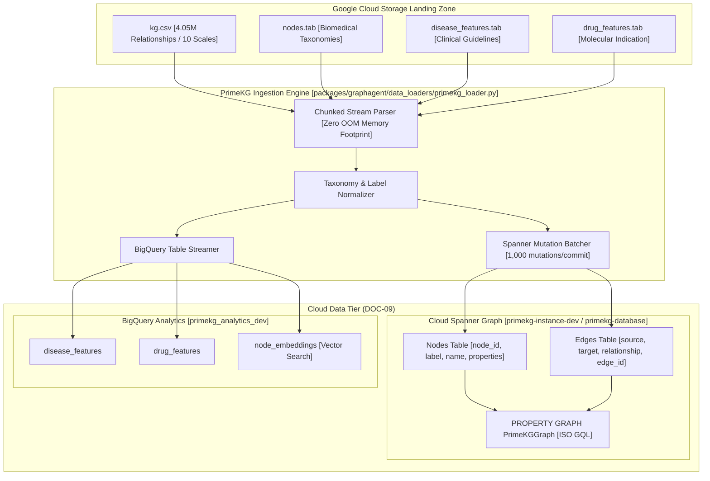

# Spec 04: Monorepo Phase 3 - Worker Tier PrimeKG Ingestion into Spanner Graph & BigQuery

**Milestone**: Phase 3 Worker Tier PrimeKG Ingestion  
**Status**: APPROVED & READY FOR IMPLEMENTATION  
**Governing Architecture MCP**: [gea-agents-arch-guidelines-mcp-server](https://github.com/prdmohangoogley/gea-agents-arch-guidelines-mcp-server)  
**Guidelines Cited**: `DOC-09` (Platform-Native State Management: Spanner Graph + BigQuery), `DOC-02` (Zero Ambient Authority), `DOC-01` (Quality Engineering & Observability)

---

## 1. Executive Summary & Context

With Phase 2 successfully completing the acquisition and staging of the canonical **PrimeKG** dataset in [`gs://cancer-co-scientist-primekg-data-landingzone-8156024772/releases/latest/`](https://console.cloud.google.com/storage/browser/cancer-co-scientist-primekg-data-landingzone-8156024772), Phase 3 establishes the **Worker Tier Data Ingestion Pipeline** (`packages/graphagent/data_loaders/primekg_loader.py`).

Per architectural guideline `DOC-09`, state management and knowledge storage are partitioned according to workload characteristics:
1. **Property Graph Traversal (Cloud Spanner Graph)**: Low-latency multi-hop topological queries (e.g. `Gene` -> `INTERACTS_WITH` -> `Gene` -> `ASSOCIATED_WITH` -> `Disease` <- `TARGETS` <- `Drug`) executed via parameterized ISO GQL.
2. **High-Dimensional Analytics & Embeddings (Google BigQuery)**: Large tabular scans, multimodal phenotypic guidelines, clinical trial aggregations, and vector similarity search.

---

## 2. Ingestion Architecture & Data Flow



---

## 3. Entity & Relationship Normalization Mapping

The loader maps raw PrimeKG categories into typed property graph labels and BigQuery features:

### 3.1 Node Label Mapping
| PrimeKG `x_type` / `y_type` | Spanner Graph Label | Canonical ID Prefix | Example Entity |
| :--- | :--- | :--- | :--- |
| `gene/protein` | `Gene` | `NCBI:` | `EGFR`, `TP53`, `BRAF` |
| `disease` | `Disease` | `MONDO:` / `UMLS:` | `Glioblastoma`, `Non-small cell lung cancer` |
| `drug` | `Drug` | `DB:` (DrugBank) | `Erlotinib`, `Osimertinib` |
| `pathway` | `Pathway` | `REACTOME:` | `Signaling by EGFR`, `Cell Cycle` |
| `anatomy` | `Anatomy` | `UBERON:` | `Brain`, `Lung`, `Liver` |
| `biological_process` | `BiologicalProcess` | `GO:` | `DNA repair`, `Apoptosis` |
| `molecular_function` | `MolecularFunction` | `GO:` | `Kinase activity`, `Receptor binding` |
| `cellular_component` | `CellularComponent` | `GO:` | `Plasma membrane`, `Nucleus` |
| `effect/phenotype` | `EffectPhenotype` | `HP:` | `Anemia`, `Weight loss` |
| `exposure` | `Exposure` | `EXPO:` | `Tobacco smoking`, `Radiation` |

### 3.2 Edge Relationship Mapping
| PrimeKG `relation` | Spanner Graph Edge Label | Direction | Description |
| :--- | :--- | :--- | :--- |
| `drug_protein` | `TARGETS` | `(Drug) -> (Gene)` | Pharmacological drug-target binding |
| `indication` | `INDICATION` | `(Drug) -> (Disease)` | Approved clinical therapeutic use |
| `contraindication` | `CONTRAINDICATION` | `(Drug) -> (Disease)` | Adverse or hazardous application |
| `off-label use` | `OFF_LABEL_USE` | `(Drug) -> (Disease)` | Secondary clinical adoption |
| `disease_protein` | `ASSOCIATED_WITH` | `(Gene) -> (Disease)` | Genomic driver or biomarker association |
| `protein_protein` | `INTERACTS_WITH` | `(Gene) -> (Gene)` | Physical or functional PPI interaction |
| `pathway_protein` | `PART_OF_PATHWAY` | `(Gene) -> (Pathway)` | Canonical pathway membership |
| `anatomy_protein_present` | `EXPRESSED_IN` | `(Gene) -> (Anatomy)` | Tissue-specific baseline gene expression |
| `disease_phenotype_positive`| `MANIFESTS_AS` | `(Disease) -> (EffectPhenotype)` | Phenotypic clinical manifestation |

---

## 4. Cloud Infrastructure as Code Requirements

### 4.1 Spanner Property Graph DDL (`packages/graphagent/iac/spanner.tf`)
- Instance: `primekg-instance-dev` (100 Processing Units, regional `us-central1`).
- Database: `primekg-database`.
- DDL Schema:
  - `Nodes` table (Primary Key: `node_id`).
  - `Edges` table (Primary Key: `source_id, target_id, edge_id`, Foreign Keys to `Nodes`).
  - `PrimeKGGraph` property graph definition declaring node tables and edge tables.

### 4.2 BigQuery Feature Dataset (`packages/graphagent/iac/bigquery.tf`)
- Dataset: `primekg_analytics_dev` in `us-central1`.
- Tables:
  - `disease_features`: Phenotypic descriptions, UMLS/MONDO mappings, clinical text.
  - `drug_features`: Molecular weights, SMILES formulas, pharmacodynamics, DrugBank indications.
  - `node_embeddings`: 768-dimensional text-embedding vectors for semantic entity search.

---

## 5. Ingestion Engine Implementation (`primekg_loader.py`)

The pipeline implements streaming data ingestion with the following capabilities:
1. **Low Memory Streaming**: Processes CSV rows iteratively with `csv.DictReader` in configurable chunk sizes (default 2,000 triples/batch), preventing out-of-memory errors on large files.
2. **Entity Deduplication**: In-memory caching of seen node IDs to prevent redundant inserts across 4.05M edge records.
3. **Spanner Batch Mutations**:
   - Uses `database.batch()` / `database.batch_write()` with retry exponential backoff for Spanner mutation limits.
4. **BigQuery Bulk Ingestion**:
   - Streams tabular feature dumps (`disease_features.tab`, `drug_features.tab`) into BigQuery analytical tables.
5. **Execution CLI**:
   ```bash
   uv run python -m packages.graphagent.data_loaders.primekg_loader \
     --project-id fivedaysai-prd-sandbox-317383 \
     --spanner-instance primekg-instance-dev \
     --spanner-database primekg-database \
     --bq-dataset primekg_analytics_dev \
     --limit 5000 \
     --source /tmp/primekg_staging/
   ```

---

## 6. Acceptance Criteria

- [ ] Terraform in `packages/graphagent/iac/` provisions `primekg-instance-dev` and `primekg_analytics_dev`.
- [ ] Spanner database `primekg-database` contains active `PrimeKGGraph` property graph.
- [ ] `primekg_loader.py` validates parsing and ingestion into both Spanner Graph and BigQuery without data truncation.
- [ ] Sample ISO GQL queries executed by `SpannerGraphTool` successfully traverse multi-hop paths.
