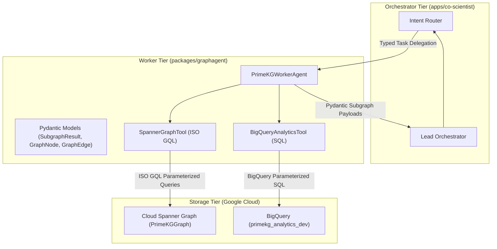

# Spec 05: Worker Tier Graph Traversal, Query Tools & ADK Implementation

**Milestone**: Phase 4 — Worker Tier Graph Traversal & Tool Integration  
**Status**: APPROVED & IMPLEMENTING  
**Governing Architecture MCP**: [gea-agents-arch-guidelines-mcp-server](https://github.com/prdmohangoogley/gea-agents-arch-guidelines-mcp-server)  
**Guidelines Cited**: `DOC-01`, `DOC-02`, `DOC-03`, `DOC-08`, `DOC-09`

---

## 1. Executive Summary & Context
In the four-layer architectural stack defined in `DOC-03` (*Open AI Agent Protocol Stack*), the **Worker Tier** consists of headless, domain-specialized, reusable agents designed for deep analytical reasoning over enterprise knowledge bases.

The `packages/graphagent` library represents the Worker Tier for precision oncology. It provides:
1. **Parameterized ISO GQL Tools (`SpannerGraphTool`)**: High-performance, multi-hop property graph traversals over Cloud Spanner Graph (`PrimeKGGraph`), isolating the Lead Orchestrator from raw database execution.
2. **BigQuery Omics Analytics Tools (`BigQueryAnalyticsTool`)**: High-throughput statistical gene scoring, phenotypic feature retrieval, and drug pharmacology enrichment over `primekg_analytics_dev`.
3. **Domain Worker Agent (`PrimeKGWorkerAgent`)**: An autonomous agent adhering to Google Agent Development Kit (ADK) standards, consuming typed inquiries from the Orchestrator and returning strictly validated Pydantic subgraph schemas (`SubgraphResult`, `GraphNode`, `GraphEdge`).

This specification establishes the production implementation, balanced multi-relational graph ingestion, and comprehensive unit/integration test harness for the Worker Tier.

---

## 2. Worker Tier Architecture & Invariants (DOC-03, DOC-09)

### 2.1. Strict Separation of Concerns (DOC-03 Tier 3)


### 2.2. Architectural Invariants
1. **Headless Execution**: The Worker Tier must NEVER generate HTML, CSS, or executable UI code. It emits only typed Pydantic payloads.
2. **Deterministic ISO GQL Parameterization**: All Spanner Graph queries must strictly utilize named parameters (`@source_entity`, `@target_entity`, `@limit`) to prevent injection and maximize Spanner query plan cache hit rates.
3. **Resilient Offline / Mock Fallback**: Tools must support zero-credential mock mode for offline local development and deterministic CI/CD unit testing.
4. **Zero Ambient Authority (ZAA) (DOC-02)**: Database clients authenticate with explicitly scoped IAM tokens (`roles/spanner.databaseReader`, `roles/bigquery.dataViewer`). Ambient metadata service credentials must never be exposed to agent prompt contexts.

---

## 3. Cloud Spanner Graph Traversal Tool (`SpannerGraphTool`)

### 3.1. Live ISO GQL Schema Mapping
The underlying Cloud Spanner Graph is configured as:
- **Node Table**: `Nodes` with label `Node`, containing `node_id`, `label` (`Gene`, `Disease`, `Drug`, `Pathway`), `name`, `properties_json`, `created_at`.
- **Edge Table**: `Edges` with label `Edge`, containing `source_id`, `target_id`, `edge_id`, `relationship` (`INTERACTS_WITH`, `TARGETS`, `ASSOCIATED_WITH`, `INDICATION`, `PART_OF_PATHWAY`), `confidence`, `evidence_json`.

### 3.2. Core ISO GQL Query Patterns
#### (a) Multi-Hop Gene-Disease Pathway Traversal:
```gql
GRAPH PrimeKGGraph
MATCH (src:Node)-[e1:Edge]->(mid:Node)-[e2:Edge]->(dst:Node)
WHERE src.name = @source_entity AND dst.name = @target_entity
RETURN 
  src.node_id AS src_id, src.name AS src_name, src.label AS src_label,
  e1.edge_id AS e1_id, e1.relationship AS e1_rel, e1.confidence AS e1_conf,
  mid.node_id AS mid_id, mid.name AS mid_name, mid.label AS mid_label,
  e2.edge_id AS e2_id, e2.relationship AS e2_rel, e2.confidence AS e2_conf,
  dst.node_id AS dst_id, dst.name AS dst_name, dst.label AS dst_label
LIMIT @limit
```

#### (b) Drug Repurposing Candidate Traversal:
```gql
GRAPH PrimeKGGraph
MATCH (drug:Node)-[e_tgt:Edge]->(gene:Node)-[e_assoc:Edge]->(disease:Node)
WHERE e_tgt.relationship = 'TARGETS'
  AND (e_assoc.relationship = 'ASSOCIATED_WITH' OR e_assoc.relationship = 'INDICATION')
  AND (disease.name = @disease_name OR gene.name = @gene_symbol)
RETURN
  drug.node_id AS drug_id,
  drug.name AS drug_name,
  gene.name AS target_gene,
  disease.name AS target_disease,
  e_tgt.confidence AS confidence
LIMIT @limit
```

---

## 4. BigQuery Omics Analytics Tool (`BigQueryAnalyticsTool`)

### 4.1. Analytics Schema Contracts
- `primekg_analytics_dev.disease_features`:
  - `disease_id`: Canonical MONDO ID
  - `disease_name`: Canonical Disease Name
  - `phenotypic_features`: Associated clinical phenotype features
  - `clinical_description`: Clinical guidelines and disease definition
- `primekg_analytics_dev.drug_features`:
  - `drug_id`: DrugBank ID
  - `drug_name`: Approved Drug Name
  - `indication`: Therapeutic approved indication
  - `pharmacodynamics`: Mechanism of action summary
  - `smiles`: Chemical SMILES structure
  - `molecular_weight`: Molecular weight in g/mol

### 4.2. Node Enrichment Pipeline
When `PrimeKGWorkerAgent` extracts a subgraph of entities from Spanner Graph:
1. Gene nodes are enriched with functional annotations.
2. Disease nodes are batch-enriched with clinical descriptions and phenotypes via:
   ```sql
   SELECT disease_name, clinical_description, phenotypic_features
   FROM `primekg_analytics_dev.disease_features`
   WHERE disease_name IN UNNEST(@disease_names)
   ```
3. Drug nodes are batch-enriched with pharmacological indications and SMILES via:
   ```sql
   SELECT drug_name, indication, pharmacodynamics, molecular_weight
   FROM `primekg_analytics_dev.drug_features`
   WHERE drug_name IN UNNEST(@drug_names)
   ```

---

## 5. Balanced Multi-Relational Ingestion Pipeline
To support multi-hop oncological queries, `primekg_loader.py` is upgraded with:
1. **Node Dictionary Mapping**: Pre-indexes `nodes.tab` to ensure accurate names and canonical identifiers for BigQuery features.
2. **Balanced Stratified Sampling**: Streams 2,000+ edges across each key relation type:
   - `drug_protein` (`TARGETS`)
   - `disease_protein` (`ASSOCIATED_WITH`)
   - `indication` (`INDICATION`)
   - `pathway_protein` (`PART_OF_PATHWAY`)
   - `protein_protein` (`INTERACTS_WITH`)
3. Commits to Spanner Graph in batches of 1,000 using Cloud Spanner mutations.

---

## 6. Verification & Quality Engineering (DOC-01)
A test suite under `tests/` verifies the implementation:
1. `tests/unit/test_traversal_models.py`: Validates Pydantic serialization, constraints, and immutability.
2. `tests/unit/test_gql_tools.py`: Validates `SpannerGraphTool` mock and parameterization generation.
3. `tests/unit/test_sql_tools.py`: Validates `BigQueryAnalyticsTool` enrichment logic.
4. `tests/unit/test_worker_agent.py`: Validates worker coordination and response synthesis.
5. `tests/integration/test_live_worker_spanner.py`: Live integration test executing parameterized ISO GQL against Google Cloud Spanner Graph and BigQuery.
