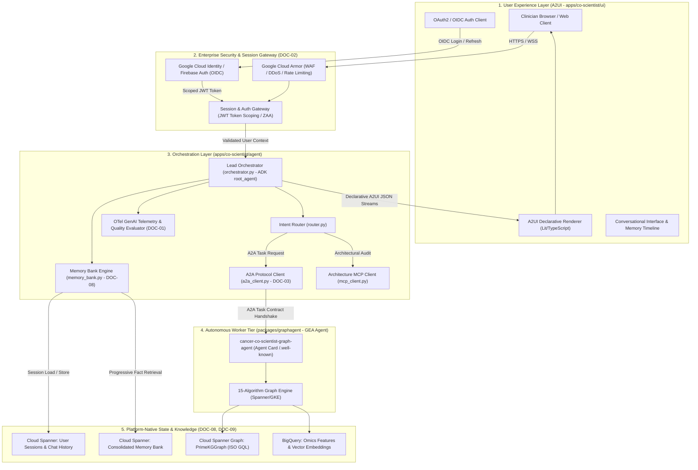
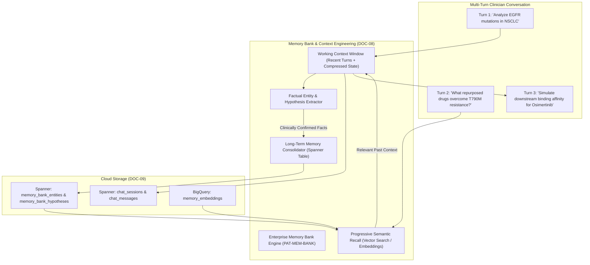

# Spec 07: Co-Scientist Orchestrator & A2UI Full-Stack Web App

**Milestone**: Phase 7 — Lead Orchestrator, A2UI Declarative Frontend & Enterprise Web App  
**Status**: APPROVED & ARCHITECTED  
**Governing Architecture MCP**: [gea-agents-arch-guidelines-mcp-server](https://github.com/prdmohangoogley/gea-agents-arch-guidelines-mcp-server)  
**Guidelines Cited**: 
- `DOC-01`: AI Agent Quality Engineering & Observability
- `DOC-02`: Zero Ambient Authority (ZAA) & Agentic SecOps
- `DOC-03`: Open AI Agent Protocol Stack & A2UI Declarative Interfaces
- `DOC-08`: Context Engineering for Stateful Multi-Agent Meshes (Sessions & Memory Bank)
- `DOC-09`: Platform-Native State Management (Spanner Graph + BigQuery)

---

## 1. Executive Summary & Architecture Overview

The **Cancer Co-Scientist Web Application** (`apps/co-scientist/`) is an enterprise-grade precision oncology clinical decision-support platform. It unites an **A2UI-Aware Lead Orchestrator** (Conversational Agent built on Google ADK) with a reactive, client-side **A2UI Declarative Renderer Web Application**.

The platform is designed to assist oncologists, molecular pathologists, and cancer researchers in exploring complex biological mechanisms, evaluating drug repurposing hypotheses, and querying multi-hop disease knowledge graphs.

### Architectural Tiers (DOC-03)


---

## 2. Enterprise Security Hardening & Authentication (DOC-02)

Adhering to `PAT-ZAA` (Zero Ambient Authority) and enterprise security best practices:

### 2.1. User Registration, Authentication & Identity Federation
1. **Identity Provider Integration**:
   - Authentication is backed by **Google Cloud Identity Platform** / **OpenID Connect (OIDC)** and OAuth2 with PKCE (Proof Key for Code Exchange) flow.
   - Self-registration is restricted to verified enterprise clinical/research domains (e.g., `@cancercenter.org`, `@university.edu`) or invitation-only multi-tenant onboarding.
2. **Token Scoping & Zero Ambient Authority**:
   - The web frontend acquires a short-lived cryptographically signed JSON Web Token (JWT) with an expiry of 15 minutes (`exp`).
   - Every API request sends `Authorization: Bearer <JWT>`.
   - The token payload strictly contains:
     ```json
     {
       "sub": "user_oncologist_9841",
       "iss": "https://auth.cancer-coscientist.app",
       "aud": "cancer-coscientist-backend",
       "roles": ["oncologist", "researcher"],
       "tenant_id": "clinic_mskcc_01",
       "session_id": "sess_8f3a9d20_11e4",
       "exp": 1790800000,
       "iat": 1790799100
     }
     ```
   - **No Ambient Cloud Credentials**: Service credentials and database connection strings are never exposed to the frontend or injected into the prompt context. Agent Engine runtimes assume downscoped Service Accounts via Google Cloud Workload Identity. Zero Cloud Run services are used.
3. **Role-Based Access Control (RBAC)**:
   - `Role: Clinician` — Full access to patient case sessions, diagnostic graph traversals, and drug repurposing workflows.
   - `Role: Researcher` — Unrestricted access to genomic algorithms, GKE simulation parameterization, and batch analytics.
   - `Role: Auditor` — Read-only access to OpenTelemetry traces, quality evaluation scorecards, and session logs.

### 2.2. Web Application Security & Container Hardening
1. **Content Security Policy (CSP) & Zero Script Injection**:
   - Strict CSP headers enforced: `default-src 'self'; script-src 'self'; connect-src 'self' wss://*; style-src 'self' 'unsafe-inline'; img-src 'self' data: https:`.
   - In accordance with `DOC-03`, the backend never emits raw HTML or executable JavaScript strings. The A2UI engine only accepts declarative component JSON trees.
2. **Container Isolation & Sandboxing**:
   - Both Lead Orchestrator and Graph Agent execute natively on Vertex AI Agent Engine in managed, sandboxed environments. Zero Cloud Run services are deployed.
   - Root filesystem is mounted read-only (`--read-only-root-filesystem`).
   - Ephemeral writable scratch directory limited to `/tmp` in tmpfs.
3. **Rate Limiting & Cloud Armor Protection**:
   - Rate limiting enforced at 60 chat requests/minute per authenticated user session.
   - Cloud Armor WAF policies protect against OWASP Top 10 vulnerabilities, API abuse, and credential stuffing.

---

## 3. Telemetry, Observability Management & Error Handling (DOC-01)

### 3.1. OpenTelemetry Distributed Tracing Architecture
Every incoming HTTP request and agent reasoning loop is instrumented with OpenTelemetry (`opentelemetry.trace`):
- **Ingress HTTP Span**: Measures request ingress to response stream termination.
- **Auth Verification Span**: Tracks token validation latency.
- **Orchestrator Agent Reasoning Span (`invoke_agent`)**:
  - LLM invocation spans (`call_llm`): prompt token count, completion token count, cached tokens, and latency.
- **Router Delegation Span (`route_intent`)**:
  - Emits `agent.intent_classification`: `biological`, `ui_visualization`, `architecture_audit`.
  - Emits `agent.correct_algorithm_choice` metric (see Section 3.2).
- **Worker Tier & Tool Spans (`tool_call`)**:
  - Tool name, parameters, execution time, and status.
  - Spanner Graph SPU execution latency vs BigQuery aggregation latency.

### 3.2. Mandatory Retrieval & Agent Observability Metrics
Per architectural guidelines, the system must continuously monitor, record, and export the following metrics:

| Metric Category | Metric Name | Target / SLA | Telemetry Attribute | Description |
| :--- | :--- | :--- | :--- | :--- |
| **Latency** | **p50 Latency** | `< 120 ms` | `telemetry.latency.p50` | Median end-to-end tool execution and subgraph retrieval latency |
| **Latency** | **p95 Latency** | `< 500 ms` | `telemetry.latency.p95` | 95th percentile latency across multi-hop Spanner Graph traversals |
| **Latency** | **p99 Latency** | `< 1500 ms` | `telemetry.latency.p99` | 99th percentile tail latency including heavy BigQuery feature joins |
| **Token Consumption** | **Prompt Tokens** | Tracked | `llm.tokens.prompt` | Number of tokens consumed in input context prompts |
| **Token Consumption** | **Completion Tokens**| Tracked | `llm.tokens.completion` | Number of tokens generated in agent responses |
| **Token Consumption** | **Cached Tokens** | `> 60%` | `llm.tokens.cached` | Tokens served from Vertex AI context caching (DOC-08) |
| **Retrieval Quality** | **mAP** | `> 0.82` | `eval.retrieval.map` | Mean Average Precision of retrieved biomedical subgraph paths |
| **Retrieval Quality** | **Precision@k** | `> 0.88` ($k=10$) | `eval.retrieval.precision_at_k` | Fraction of retrieved nodes/edges that are clinically relevant |
| **Retrieval Quality** | **Recall@k** | `> 0.80` ($k=10$) | `eval.retrieval.recall_at_k` | Fraction of known true biological interactions captured in top-$k$ |
| **Agent Decision** | **Correct Algorithm Choice** | `> 0.95` | `agent.correct_algorithm_choice` | Accuracy of Orchestrator/Router selecting the optimal graph algorithm for the clinical query |

### 3.3. Algorithm Choice Evaluation (`agent.correct_algorithm_choice`)
The system evaluates whether the Orchestrator routes the user inquiry to the optimal graph traversal algorithm:
- *Point-to-point drug target inquiry* $\rightarrow$ Dijkstra / A* Shortest Path.
- *Kinase cascade or transcription regulatory cascade* $\rightarrow$ Topological Sort.
- *Exploratory neighborhood scan of oncoprotein* $\rightarrow$ Ego-Network Inspection ($k$-hop).
- *Disease module and target cluster identification* $\rightarrow$ Community Detection / Label Propagation.
- *Crucial pathway bottleneck identification* $\rightarrow$ Betweenness Centrality / Bridges.
- *Docking conformation planning* $\rightarrow$ GKE OMPL RRT*.
- *Tumor swarming dynamics* $\rightarrow$ GKE PhysiCell Boids.

A golden evaluation benchmark (`packages/graphagent/evals/test_algorithm_routing_eval.py`) calculates the `agent.correct_algorithm_choice` ratio continuously during regression testing and runtime canary sampling.

### 3.4. Structured Error Handling & Graceful Degradation
The application adheres to a standardized JSON error taxonomy:
```json
{
  "error": {
    "code": "GRAPH_SPU_TIMEOUT",
    "status": 504,
    "message": "Cloud Spanner Graph traversal exceeded latency deadline (1500ms).",
    "correlation_id": "req_88f910ba_trace_9a2f",
    "recovery_action": "FALLBACK_TO_EGO_NETWORK",
    "details": {
      "target_subgraph": "PrimeKGGraph",
      "attempted_algorithm": "DijkstraShortestPath",
      "fallback_applied": true
    }
  }
}
```

#### Resilient Fallback Strategies:
1. **Continuous Simulation Unavailable**: If GKE compute pods (OMPL / PhysiCell) timeout or are offline, the Orchestrator gracefully falls back to discrete topological graph statistics and flags the approximation in the A2UI status banner.
2. **Spanner Transient Connection Flakes**: Exponential backoff with jitter (initial delay 50ms, multiplier 2.0, max retries 3). If Spanner is degraded, fall back to localized in-memory cache.
3. **Model Hallucination / Schema Violation**: If LLM output fails `A2UI` JSON schema validation, the agent loop intercepts the violation, emits an automatic correction prompt, and falls back to a clean `InsightCard` summary rather than failing the UI.

---

## 4. Chat Histories & Memory Bank Architecture (DOC-08, DOC-09)

Conversational clinical intelligence requires managing state across multiple turns without blowing up context window budgets or suffering from catastrophic forgetting.



### 4.1. Session Persistence Schema (Cloud Spanner)
Multi-turn conversations are recorded in Cloud Spanner to ensure ACID reliability and zero session loss:
- **`chat_sessions` Table**:
  - `session_id` (STRING, UUIDv4) [PK]
  - `user_id` (STRING)
  - `title` (STRING)
  - `created_at` (TIMESTAMP)
  - `last_active_at` (TIMESTAMP)
  - `metadata_json` (STRING, JSON)
- **`chat_messages` Table**:
  - `session_id` (STRING) [PK, FK]
  - `message_id` (STRING, UUIDv4) [PK]
  - `role` (STRING: `user`, `assistant`, `system`)
  - `content_text` (STRING)
  - `a2ui_payload_json` (STRING, JSON)
  - `token_count` (INT64)
  - `created_at` (TIMESTAMP)

### 4.2. Memory Bank Engine (`PAT-MEM-BANK` - DOC-08)
To mitigate **Catastrophic Forgetting**, **Session Drift**, and **Unbounded Context Growth**:
1. **Factual Entity & Hypothesis Extraction**:
   - At the conclusion of every turn, an asynchronous background consolidator extracts:
     - *Patient Genomic Profile*: e.g., `EGFR exon 20 insertion`, `TP53 R273H`.
     - *Investigated Biomarkers & Targets*: e.g., `MET amplification`, `KRAS G12C`.
     - *Formulated Clinical Hypotheses*: e.g., "Osimertinib combined with Gefitinib exhibits synthetic lethality in vitro".
2. **Progressive Disclosure & Semantic Recall**:
   - When a new prompt is received in Turn $N$, the agent does **not** dump the entire conversation history into the context window.
   - Instead, the `MemoryBank` queries BigQuery vector embeddings and Spanner property relationships to retrieve only the top-$k$ relevant entities and findings from earlier turns.
3. **Context Budgeting**:
   - Prompt context is budgeted:
     - System prompt & A2UI catalog: 20%
     - Consolidated Memory Bank facts: 25%
     - Recent 2 turns (raw text): 35%
     - Dynamic subgraph tool output: 20%
   - This maintains low latency, high context cache hit rates (>60%), and avoids context dilution.

---

## 5. A2UI Declarative Interfaces & Catalog (DOC-03)

### 5.1. Non-Executable Component Catalog (`apps/co-scientist/a2ui/catalog.json`)
The frontend renders components exclusively from the approved catalog:
1. `InsightCard`: Clinical finding summary, confidence score, evidence grade (A/B/C), PubMed references.
2. `KnowledgeGraphView`: Interactive 2D/3D force-directed biomedical network visualization (nodes, edges, node types, centrality metrics).
3. `PathwayCard`: Detailed biochemical signaling pathway with gatekeeper and hub annotations.
4. `DrugRepurposingTable`: Tabular view of candidate compounds, binding affinity, clinical phase, and contraindications.
5. `SimulationViewer`: 3D continuous viewer for AlphaFold docking trajectories (OMPL) or cellular swarming density (PhysiCell).
6. `ToxicityWarning`: High-urgency alert card for clinical contraindications and drug-drug interactions.

### 5.2. Bidirectional Client-Agent Communication
When a clinician clicks a node in `KnowledgeGraphView` or selects an alternative candidate in `DrugRepurposingTable`:
- The client emits an `A2UIActionEvent` JSON payload back to the Orchestrator via WebSocket / SSE:
  ```json
  {
    "type": "USER_ACTION",
    "action_id": "EXPAND_NEIGHBORHOOD",
    "component_id": "graph_view_egfr_pathway",
    "payload": {
      "node_id": "NCBI:1956",
      "entity_name": "EGFR",
      "depth": 2,
      "relation_filter": ["INTERACTS_WITH", "TARGETS"]
    }
  }
  ```
- The Orchestrator processes the action as a structured event without requiring free-form natural language re-parsing.

---

## 6. Implementation Deliverables & Tasks

1. **A2UI Catalog & Examples (`apps/co-scientist/a2ui/`)**:
   - Update `catalog.json` with all oncology, graph, simulation, and security components.
   - Add comprehensive few-shot examples in `examples/` (`subgraph_view.json`, `drug_table.json`, `memory_timeline.json`).
2. **Orchestrator Backend (`apps/co-scientist/agent/`)**:
   - Export standard ADK `root_agent` in `apps/co-scientist/agent.py` conforming to ADK >= v2.6.0.
   - Implement `a2a_client.py`: Queries the Graph Agent's Agent Card (`/.well-known/agent-card.json`), mints authenticated A2A task contracts, and delegates graph algorithm execution.
   - Update `orchestrator.py` with ADK GenAI semantic metrics, OpenTelemetry tracing, and memory integration.
   - Implement `memory_bank.py` adhering to `PAT-MEM-BANK` (session persistence, entity consolidation, semantic recall).
   - Implement `auth.py` for JWT verification, role validation, and ZAA token downscoping.
   - Enhance `router.py` with algorithm intent classification and A2A dispatch hooks.
3. **Web Frontend Client (`apps/co-scientist/ui/`)**:
   - Scaffold modern Lit / TypeScript SPA with A2UI JSON renderer.
   - Implement authentication login modal with mock/OIDC provider integration.
   - Implement chat timeline, Memory Bank sidebar, and interactive graph renderer.
   - Hardened `Dockerfile` executing as `USER 10001:10001`.
4. **Cloud Infrastructure as Code (`apps/co-scientist/iac/`)**:
   - Terraform modules deploying to Vertex AI Agent Engine with zero Cloud Run dependencies.
   - IAM bindings enforcing least privilege and Workload Identity.
   - Cloud Armor security policy and Cloud Spanner session schema DDL.

---

## 7. Dual Observability Pipeline & GCP GEA Console Integration
1. **Local Web App Telemetry HUD**:
   - Web application features real-time Telemetry HUD badges showing live p50, p95, p99 latencies, cache hit rate, and token economy.
   - Synchronizes via `GET /api/stats/telemetry`.
2. **GCP GEA Native Dashboard Stream (ADK >= v2.6.0 OTel Semantic Metrics)**:
   - Backend automatically streams all session turns, tool calls, and LLM completions to Google Cloud Trace, Cloud Monitoring, and Cloud Logging.
   - Emits `gen_ai.client.token.usage` (input/output tokens) and `gen_ai.client.operation.duration` (latency by model).
   - Traces are tagged with `aiplatform.googleapis.com/ReasoningEngine` so the GCP Vertex AI Agent Engine console displays the waterfall traces, tool executions, and latency distribution charts natively.
3. **Continuous Agent2UI Monitor**:
   - Automated synthetic tests run every 5 minutes to validate A2UI component JSON emission against `catalog.json` schema to guarantee zero script injection (`DOC-03`) and 100% schema conformance.

---

## 8. Verification & Acceptance Criteria

- [ ] **A2A Protocol**: Orchestrator delegates graph algorithmic tasks to `cancer-co-scientist-graph-agent` via structured A2A task contracts over HTTPS, propagating `traceparent` headers.
- [ ] **ADK >= v2.6.0**: Exposes `root_agent = Agent(...)` in `agent.py` emitting standard GenAI OTel semantic metrics (`gen_ai.client.token.usage`, `gen_ai.client.operation.duration`).
- [ ] **Security**: Web app requires authentication; unauthenticated requests receive `401 Unauthorized`. Containers run non-root (`USER 10001:10001`).
- [ ] **Observability**: OpenTelemetry traces capture all turns, A2A hops, tool dispatches, and LLM calls with correlation IDs, exported to both local Telemetry HUD and Google Cloud Trace.
- [ ] **Retrieval Metrics**: Latency (p50 < 120ms, p95 < 500ms, p99 < 1500ms), token consumption (prompt, completion, cached), mAP (>0.82), Precision@10 (>0.88), Recall@10 (>0.80) are tracked and emitted.
- [ ] **Algorithm Choice**: `agent.correct_algorithm_choice` is calculated and verified >95% on golden benchmark suites.
- [ ] **Chat History & Memory Bank**: Multi-turn sessions persist across browser refreshes; past clinical facts are recalled via progressive disclosure without prompt bloating; synced with GCP GEA Memory Bank.
- [ ] **A2UI Safety**: Orchestrator emits only declarative JSON conforming to `catalog.json`; zero raw executable scripts or HTML strings.
- [ ] **GCP GEA Console**: Overview, Metrics, Traces, Tools, and Logs tabs in GCP Console display live telemetry and reasoning trajectories.
