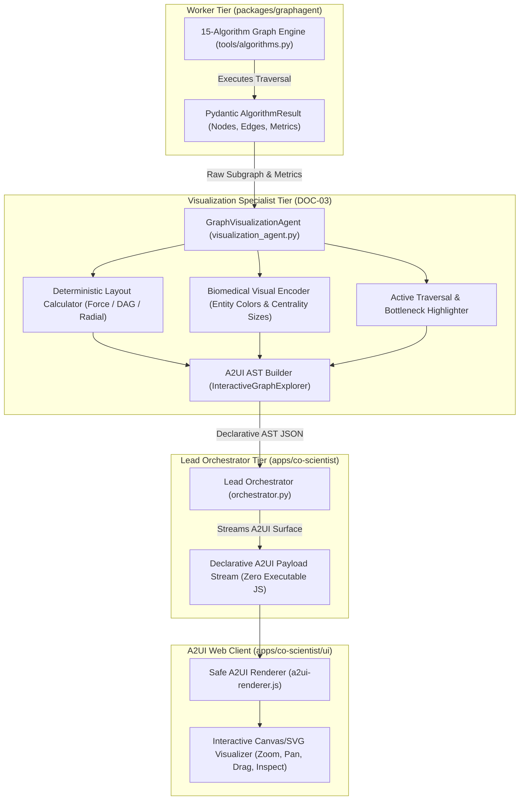

# Spec 08: Graph Visualization Specialist Agent & Interactive A2UI Graph Visualizer

**Milestone**: Phase 8 — Autonomous Graph Visualization Agent & Interactive PrimeKG Visualizer  
**Status**: APPROVED & ARCHITECTED  
**Governing Architecture MCP**: [gea-agents-arch-guidelines-mcp-server](https://github.com/prdmohangoogley/gea-agents-arch-guidelines-mcp-server)  
**Guidelines Cited**: 
- `DOC-01`: AI Agent Quality Engineering & Observability
- `DOC-02`: Zero Ambient Authority (ZAA) & Non-Executable Payload Safety
- `DOC-03`: Open AI Agent Protocol Stack & A2UI Declarative Interfaces
- `DOC-08`: Context Engineering & Progressive Disclosure for Visual Payloads
- `DOC-09`: Platform-Native State Management (Spanner Graph + BigQuery)

---

## 1. Executive Summary & Context

While Phase 6 established the **15-Algorithm Graph Engine** and Phase 7 created the **Co-Scientist Orchestrator Web App**, clinicians and oncology researchers require immediate, high-fidelity visual representations of algorithm executions—such as Dijkstra shortest therapeutic paths, community disease modules, PageRank hub proteins, betweenness gatekeepers, and continuous molecular docking trajectories.

Under **DOC-03 (Open AI Agent Protocol Stack)**, the frontend cannot execute arbitrary JavaScript or unverified code strings (`eval()`, dynamic scripts) due to Zero Ambient Authority and cross-site scripting (XSS) risks. 

Therefore, Phase 8 introduces the **Graph Visualization Specialist Agent (`VisualizationAgent`)**:
1. An autonomous specialist worker sitting between the **Computational Graph Worker** and the **Lead Orchestrator**.
2. Consumes typed `AlgorithmResult` outputs from any of the 15 graph algorithms.
3. Automatically computes optimal 2D/3D layouts (force-directed coordinates, radial cascades, hierarchical DAG tiers), centrality-based node sizing, community color clusters, directional link styling, gatekeeper highlight rings, and rich clinical tooltips.
4. Emits a rich, declarative A2UI component: **`InteractiveGraphExplorer`** conforming strictly to `apps/co-scientist/a2ui/catalog.json`.
5. Powers both the **Inline Algorithm Visualizer** (rendered beneath each query in the chat timeline) and the full-page **PrimeKG Database Explorer** in the Web App.

---

## 2. Visualization Agent Architecture & Data Flow (DOC-03)



---

## 3. Algorithm-to-Visualization Mapping

The `VisualizationAgent` automatically adapts the visual AST based on the executing algorithm:

| Algorithm / Capability | Visual Layout Strategy | Node Sizing & Highlights | Edge Styling & Annotations |
| :--- | :--- | :--- | :--- |
| **Dijkstra / A*** | Linear Directed Path | Start/End nodes highlighted; intermediate kinase steps glowing green | Animated directional arrows with edge distance/weight tags |
| **DFS / BFS** | Hierarchical Tree / Radial Tree | Root source node at center/top; discovery order badges (`1`, `2`, `3`...) | Tree branch edges distinguished from cross/back edges |
| **D* Lite Replanning** | Differential Subgraph | Nodes with mutated affinity colored amber; affected targets highlighted | Solid lines for stable paths; dashed red for disrupted interactions |
| **Connected Components** | Clustered Force-Directed | Sized by component cardinality; distinct pastel hulls per component | Dense intra-component edges; highlighted bridge cut-edges |
| **Topological Sort** | Layered DAG (Left-to-Right) | Upstream master regulators on left; downstream effectors on right | Strictly unidirectional signaling arrows |
| **Transitive Closure** | Reachability Matrix / Star DAG | Focal root node at center; all downstream reachable targets radiating | Reachability hops tagged with path length |
| **Community Detection** | Modular Force-Directed | Distinct chromatic hues per community; modularity density rings | Thick intra-module links; faded inter-module links |
| **Ego-Network ($k$-hop)** | Concentric Rings | Central focal entity at ring 0; $k=1$ hop on ring 1; $k=2$ on ring 2 | Radial connecting rays |
| **PageRank Centrality** | Force-Directed with Size Scaling | Node radius proportional to PageRank score; "Hub" badges | Edge thickness proportional to interaction confidence |
| **Betweenness Centrality** | Gatekeeper Focus | "Gatekeeper" bottleneck nodes encircled with pulsing red halos | Critical bridges connecting disconnected signaling cascades |
| **AlphaFold Docking (OMPL)** | 3D Trajectory Projection | Residue binding pocket nodes + ligand conformation pose nodes | Motion planning sample path vectors |
| **PhysiCell Swarming** | Spatial Density Grid | Cellular boids agents colored by phenotypic state | Velocity vectors & cohesive alignment streamlines |
| **Temporal Edge Tracking** | Chronological Timeline | Longitudinal appearance/disappearance states | Timestamped validity intervals (`t_valid`) |

---

## 4. A2UI Catalog Specification: `InteractiveGraphExplorer`

The component is registered in `apps/co-scientist/a2ui/catalog.json`:

```json
{
  "InteractiveGraphExplorer": {
    "description": "Interactive biomedical knowledge graph visualizer supporting pan, zoom, force simulation, node selection, and algorithm path highlighting (DOC-03 compliant)",
    "properties": {
      "title": { "type": "string" },
      "algorithm_applied": { "type": "string" },
      "layout_mode": { "type": "string", "enum": ["force-directed", "hierarchical-dag", "radial-ego", "concentric"] },
      "nodes": {
        "type": "array",
        "items": {
          "type": "object",
          "properties": {
            "id": { "type": "string" },
            "name": { "type": "string" },
            "label": { "type": "string", "enum": ["Gene", "Disease", "Drug", "Pathway", "Phenotype", "Ligand"] },
            "x": { "type": "number" },
            "y": { "type": "number" },
            "radius": { "type": "number" },
            "color": { "type": "string" },
            "is_hub": { "type": "boolean" },
            "is_gatekeeper": { "type": "boolean" },
            "is_source": { "type": "boolean" },
            "is_target": { "type": "boolean" },
            "community_id": { "type": "integer" },
            "pagerank_score": { "type": "number" },
            "details": { "type": "object" }
          },
          "required": ["id", "name", "label", "x", "y"]
        }
      },
      "edges": {
        "type": "array",
        "items": {
          "type": "object",
          "properties": {
            "source_id": { "type": "string" },
            "target_id": { "type": "string" },
            "relationship": { "type": "string" },
            "confidence": { "type": "number" },
            "is_shortest_path": { "type": "boolean" },
            "is_bridge": { "type": "boolean" },
            "style": { "type": "string", "enum": ["solid", "dashed", "animated-flow"] }
          },
          "required": ["source_id", "target_id", "relationship"]
        }
      },
      "view_box": {
        "type": "object",
        "properties": {
          "width": { "type": "number" },
          "height": { "type": "number" }
        }
      },
      "interactive_actions": {
        "type": "array",
        "items": { "type": "string", "enum": ["ZOOM_PAN", "NODE_DRAG", "CLICK_INSPECT", "EXPAND_NEIGHBORHOOD", "FILTER_RELATION"] }
      }
    },
    "required": ["title", "nodes", "edges"]
  }
}
```

---

## 5. Security & Zero Ambient Authority (DOC-02, DOC-03)

- **Zero Executable Code Injection**: Under no circumstances does the `VisualizationAgent` generate executable HTML `<script>` tags, inline `javascript:` handlers, or SVG `<foreignObject>` evaluating JavaScript.
- **Pure Declarative AST**: Layouts are fully computed server-side in Python using deterministic mathematical projections (NetworkX force layouts or topological DAG ranks) and emitted as plain numbers (`x`, `y`, `radius`, `color`).
- **Client-Side Sandbox**: The A2UI renderer builds SVG elements using safe `document.createElementNS("http://www.w3.org/2000/svg", ...)` and text nodes (`document.createTextNode()`), preventing any DOM-based XSS.

---

## 6. Observability, Telemetry & Quality Standards (DOC-01)

The `VisualizationAgent` is instrumented with OpenTelemetry:
- **Span**: `agent.visualization_generation`
- **Attributes**:
  - `gen_ai.agent.name`: `GraphVisualizationAgent`
  - `graphagent.algorithm_name`: Name of visualized algorithm
  - `graphagent.node_count`: Number of nodes placed
  - `graphagent.edge_count`: Number of edges styled
  - `graphagent.layout_latency_ms`: Time taken to compute coordinates and construct AST
- **Performance Budget**:
  - `telemetry.vis.latency.p50`: `< 15 ms`
  - `telemetry.vis.latency.p95`: `< 60 ms`
  - `telemetry.vis.latency.p99`: `< 150 ms`
- **Continuous Graph Visualization Monitor & Cloud Metrics**:
  - Emits `custom.googleapis.com/agent/visualization/layout_latency` and `custom.googleapis.com/agent/visualization/schema_errors` to Google Cloud Monitoring.
  - Automated continuous synthetic monitor generates layouts for all 15 algorithmic AST variants every 5 minutes to verify coordinate stability, node non-overlap, and strict compliance with `DOC-03`.

---

## 7. Verification & Acceptance Criteria

- [ ] `VisualizationAgent` in `apps/co-scientist/agent/visualization_agent.py` processes outputs from all 15 algorithms and emits valid `InteractiveGraphExplorer` payloads.
- [ ] `catalog.json` defines `InteractiveGraphExplorer` with full JSON schema validation.
- [ ] The A2UI renderer in `a2ui-renderer.js` renders the interactive SVG with pan, zoom, node dragging, and entity inspection modal.
- [ ] The Web App includes an inline visualizer for every graph query, plus a top-level **"🧬 PrimeKG Graph Explorer"** button and tab.
- [ ] All unit and evaluation tests pass (`pytest tests/`).
- [ ] Continuous synthetic monitor reports healthy layout computation and schema validity to Cloud Monitoring.
