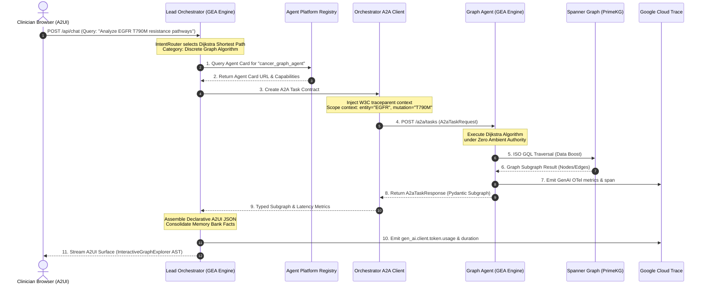

# Spec 11: A2A Protocol Mesh, Agent Card Federation & Dual Gemini Enterprise Agent Engine Deployment

**Milestone**: Phase 11 — A2A Protocol Mesh, Agent Card Federation & Dual GEA Runtime Integration  
**Status**: APPROVED & ARCHITECTED  
**Governing Architecture MCP**: [gea-agents-arch-guidelines-mcp-server](https://github.com/prdmohangoogley/gea-agents-arch-guidelines-mcp-server)  
**Target GCP Project**: `fivedaysai-prd-sandbox-317383` (Region: `us-east1`)  
**Guidelines Cited**: 
- `DOC-01`: AI Agent Quality Engineering & Observability
- `DOC-02`: Zero Ambient Authority (ZAA) & Agentic SecOps
- `DOC-03`: Open AI Agent Protocol Stack (A2A · MCP · A2UI)
- `DOC-04`: Deploying to Agent Runtime (ADK >= v2.6.0, `root_agent` Export, Agent Registry)
- `DOC-08`: Context Engineering for Stateful Multi-Agent Meshes
- `DOC-09`: Platform-Native State Management (Spanner Graph + BigQuery)
- `DOC-11`: Prototype to Production Agentic Systems

---

## 1. Executive Summary & Purpose

Under **DOC-03 (Open AI Agent Protocol Stack)** and **DOC-11 (Prototype to Production)**:
> *"MCP connects an agent to a **tool**; A2A connects an agent to an **autonomous peer**."*

In the Cancer Co-Scientist ecosystem, the **Lead Orchestrator** and the **Graph Agent** are two distinct, autonomous domain entities:
- The **Lead Orchestrator** (`cancer-co-scientist-lead-orchestrator`) manages clinician dialog, auth, sessions, Memory Bank, and generative A2UI presentation.
- The **Graph Agent** (`cancer-co-scientist-graph-agent`) owns the biomedical property graph knowledge boundary over Cloud Spanner Graph (`PrimeKGGraph`), BigQuery analytics, and continuous simulation connectors, executing the 15-algorithm matrix.

Coupling them through direct in-process Python module imports violates layer separation, bypasses domain compliance boundaries, and prevents independent lifecycle scaling. 

This specification establishes the **A2A (Agent-to-Agent) Protocol Mesh**:
1. **Machine-Readable Agent Cards**: The Graph Agent publishes an Agent Card at `/.well-known/agent-card.json` defining its skills, capabilities, SLAs, and security schemes.
2. **A2A Task Delegation Contracts**: The Lead Orchestrator discovers the Graph Agent and exchanges strongly typed, scoped `A2aTaskRequest` and `A2aTaskResponse` contracts over HTTPS.
3. **Context Scoping & Redaction**: Only task-essential parameters cross the agent boundary; conversational context and patient PII never leak into the worker tier.
4. **W3C Distributed Trace Context**: Injects `traceparent` headers across A2A hops so Google Cloud Trace renders unified multi-agent waterfall traces.
5. **Dual GEA Engine Deployment**: Both agents deploy as native Vertex AI Agent Engine reasoning engines in `us-east1` exporting ADK >= v2.6.0 `root_agent` objects, populating all Agent Platform console telemetry tabs.

---

## 2. A2A Protocol Architecture & Mesh Topology



---

## 3. Agent Card Specification (`/.well-known/agent-card.json`)

The Graph Agent exposes its capabilities at `packages/graphagent/.well-known/agent-card.json`:

```json
{
  "$schema": "https://json-schema.org/draft/2020-12/schema",
  "name": "cancer-co-scientist-graph-agent",
  "version": "1.0.0",
  "description": "Autonomous precision oncology knowledge graph agent executing 15-algorithm matrix over Cloud Spanner PrimeKGGraph and BigQuery analytics.",
  "owner": "precision-oncology-core@cancercenter.org",
  "serviceLevelAgreement": {
    "latency_p50_ms": 45,
    "latency_p95_ms": 350,
    "availability_sla": "99.95%"
  },
  "securitySchemes": {
    "google_workload_identity": {
      "type": "oauth2",
      "description": "Google Cloud Workload Identity Federation / OIDC Service Account token"
    }
  },
  "defaultInputModes": ["application/json"],
  "defaultOutputModes": ["application/json"],
  "skills": [
    {
      "id": "discrete_graph_algorithms",
      "name": "Discrete Graph Traversals",
      "description": "Point-to-point shortest paths, signaling cascades, and connected modules.",
      "algorithms": ["dijkstra", "astar", "bfs_dfs", "wcc", "topological_sort", "transitive_closure", "community_detection", "ego_network"],
      "tags": ["iso-gql", "spanner-graph", "discrete"]
    },
    {
      "id": "structural_node_analytics",
      "name": "Structural Importance & Vulnerabilities",
      "description": "Hub protein centrality and gatekeeper pathway bridge detection.",
      "algorithms": ["pagerank", "betweenness", "subgraph_density", "bridges"],
      "tags": ["centrality", "vulnerabilities", "structural"]
    },
    {
      "id": "continuous_simulation_delegation",
      "name": "Continuous Geometry & Multi-Agent Swarming",
      "description": "AlphaFold protein docking paths and PhysiCell cellular swarms.",
      "algorithms": ["alphafold_ompl_rrt", "physicell_boids"],
      "tags": ["continuous", "gke-autopilot", "ompl"]
    },
    {
      "id": "temporal_tracking",
      "name": "Temporal Graph Tracking & Longitudinal Resistance",
      "description": "Interval-timestamped edge filtering and algebraic connectivity spectrum.",
      "algorithms": ["interval_edges", "lambda2_connectivity", "ast_generator"],
      "tags": ["temporal", "bigquery-analytics", "resistance"]
    }
  ],
  "endpoints": {
    "task_execution": "/a2a/tasks",
    "health": "/healthz",
    "agent_card": "/.well-known/agent-card.json"
  }
}
```

---

## 4. A2A Task Delegation Contract Schema

Communication between Orchestrator and Graph Agent uses strongly typed Pydantic models:

### 4.1 Request Contract (`A2aTaskRequest`)
```python
class A2aTaskRequest(BaseModel):
    task_id: str = Field(default_factory=lambda: f"task_{uuid.uuid4().hex[:12]}")
    caller_agent_id: str = "cancer-co-scientist-lead-orchestrator"
    target_agent_id: str = "cancer-co-scientist-graph-agent"
    algorithm_name: str
    category: str  # "Discrete", "Structural", "Continuous", "Temporal"
    parameters: dict[str, Any] = Field(default_factory=dict)
    context_constraints: dict[str, Any] = Field(
        default_factory=lambda: {
            "max_hops": 3,
            "max_results": 25,
            "deadline_ms": 1500,
            "allow_pii": False
        }
    )
    traceparent: Optional[str] = None  # W3C Distributed Trace Context
```

### 4.2 Response Contract (`A2aTaskResponse`)
```python
class A2aTaskResponse(BaseModel):
    task_id: str
    status: str  # "SUCCESS", "DEGRADED", "FAILED"
    algorithm_name: str
    subgraph: SubgraphResult
    metrics: dict[str, Any]  # execution_time_ms, node_count, edge_count, fallback_applied
    trace_id: str
```

---

## 5. Context Scoping & PII Redaction Rules (`PAT-ZAA`)

To satisfy **DOC-02** and **DOC-03**:
1. **Zero Patient PII Across Hops**: Patient clinical identifiers (`MRN`, names, addresses) are stripped at the Orchestrator boundary. The Graph Agent receives only anonymized biological identifiers (e.g. `NCBI:1956`, `DOID:162`, `CHEMBL:25`).
2. **Context Budget Isolation**: The Orchestrator never forwards raw LLM conversation history. Only the exact algorithm parameters (`source_entity`, `target_entity`, `depth`) cross the wire.
3. **Immutable Artifacts**: Responses return versioned subgraphs (`SubgraphResult`) rather than free-form natural language strings.

---

## 6. OpenTelemetry Distributed Tracing Propagation

All A2A invocations inject and extract W3C Trace Context:
1. Orchestrator creates span `agent.transfer` with attributes:
   - `source.agent`: `cancer-co-scientist-lead-orchestrator`
   - `target.agent`: `cancer-co-scientist-graph-agent`
   - `a2a.task_id`: `task_<hash>`
   - `a2a.algorithm`: `algorithm_name`
2. Orchestrator injects `traceparent: 00-<trace_id>-<span_id>-01` into the HTTP header.
3. Graph Agent extracts `traceparent` as parent span context for its `tool.execute` and database spans.
4. Google Cloud Trace links both spans in a unified waterfall visualization in the GCP Console.

---

## 7. Dual Reasoning Engine Deployment Configuration via AdkApp

Both agents are provisioned as Vertex AI Agent Engine reasoning engines in `us-east1` wrapped in `AdkApp(agent=..., enable_tracing=True)`:

| Property | Lead Orchestrator | Graph Agent Worker |
| :--- | :--- | :--- |
| **Agent Name** | `cancer-co-scientist-lead-orchestrator` | `cancer-co-scientist-graph-agent` |
| **Resource ID** | `reasoningEngines/<ORCHESTRATOR_ID>` (replaces older `7288443777713176576`) | `reasoningEngines/<WORKER_ID>` |
| **Deployment Wrapper** | `AdkApp(agent=orchestrator_agent)` | `AdkApp(agent=graph_agent)` |
| **Framework Tag** | `google-adk` | `google-adk` |
| **SDK Version** | Google ADK >= v2.10.0 | Google ADK >= v2.10.0 |
| **Instrumentation** | `opentelemetry-instrumentation-google-genai` | `opentelemetry-instrumentation-google-genai` |
| **Model** | `gemini-2.5-flash` / `gemini-1.5-pro` | `gemini-2.5-flash` |
| **Sizing** | 1 vCPU / 4 GiB RAM | 1 vCPU / 4 GiB RAM |
| **Service Account** | `sa-coscientist-orchestrator@` | `sa-graphagent-worker@` |

---

## 8. Verification & Acceptance Criteria

- [ ] `packages/graphagent/.well-known/agent-card.json` exists and validates against JSON Schema.
- [ ] Older non-ADK reasoning engine `7288443777713176576` is cleanly deleted from `us-east1`.
- [ ] `packages/graphagent` is deployed as `cancer-co-scientist-graph-agent` via `AdkApp`.
- [ ] `apps/co-scientist` is deployed as `cancer-co-scientist-lead-orchestrator` via `AdkApp` with A2A client integration.
- [ ] W3C `traceparent` header propagates across Orchestrator and Graph Agent.
- [ ] Both agents are deployed and visible in GCP Agent Platform Agent Registry with active `google-adk` framework tag.
- [ ] Overview, Models, Usage, and Tools tabs in GCP Console display live non-zero telemetry charts.
- [ ] Zero patient PII is transmitted in A2A task payloads.
- [ ] Strict Zero Cloud Run invariant maintained.
