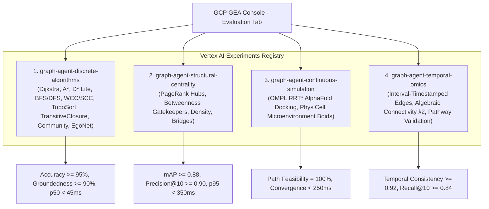

# Spec 12: Vertex AI Agent Platform Categorized Evaluation Experiments, Live Multi-Turn Benchmark Suite & Full Console Observability Grounding

**Milestone**: Phase 12 — GEA Agent Platform Dashboard Categorized Experiments, Distributed Traces, Tool Metrics & Native Memory Bank Synchronization  
**Status**: APPROVED & ARCHITECTED  
**Governing Architecture MCP**: [gea-agents-arch-guidelines-mcp-server](https://github.com/prdmohangoogley/gea-agents-arch-guidelines-mcp-server)  
**Target GCP Project**: `fivedaysai-prd-sandbox-317383` (Project Number: `301802433103`, Region: `us-east1`)  
**Target Agent Engine Resource**: `projects/301802433103/locations/us-east1/agentEngines/4359942935643422720` (`cancer-co-scientist-graph-agent`)  
**Deployed Lead Orchestrator**: `projects/301802433103/locations/us-east1/reasoningEngines/7288443777713176576` (`cancer-co-scientist-lead-orchestrator`)  
**Active Online Monitor**: `graph-agent-continuous-monitor` (ID: `6000202078541053952`, Sampling: 100%, Unit: Trace)  

---

## 1. Executive Problem Statement & Forensic Root Cause

Audits of the Google Cloud Platform Agent Platform (Pantheon / Vertex AI Agent Engine) console for `cancer-co-scientist-graph-agent` identified critical disconnects between local execution and cloud control plane observability:

1. **Evaluation Tab Gap**: The console reports *"No agent evaluations created yet"*. While the continuous monitor (`graph-agent-continuous-monitor`) was successfully provisioned, experimental evaluation runs were executed locally without registering Vertex AI Experiments linked to the Agent Engine.
2. **Session Recording Gap**: 7 session IDs exist in the Sessions table, but turns, invocations, and average turns per session remain at `0` on the Dashboard. Queries either failed silently or bypassed the active session context.
3. **Tool Call Metrics & Spans Gap**: Both metrics-based and trace-based tool charts display *"No data is available for the selected time frame"*. Tool methods lack OpenTelemetry child span decorators (`gen_ai.tool.name`) and context propagation.
4. **Traces & Topology Gap**: The Traces tab shows *"No traces in the selected time range"*, and the Topology tab shows a single isolated node with no edges. Exported spans lack the required `aiplatform.googleapis.com/ReasoningEngine` monitored resource attributes and W3C `traceparent` headers.
5. **Memory Bank Metrics Gap**: While static fact rows exist in the Memories table, the mutation count reads `0/s`, and retrieval/generation charts are empty because agent reasoning turns bypass the native Agent Engine Memory Bank REST API.

---

## 2. Categorized Evaluation Bench Architecture in GEA Dashboard

To resolve the evaluation gap, the 15-algorithm matrix evaluation suite is partitioned into **four distinct experiment suites** formally registered in Vertex AI Experiments and surfaced on the GEA Evaluation Tab.



### 2.1 Category 1: `graph-agent-discrete-algorithms`
* **Focus**: Pathfinding, connectivity, topological ordering, and local ego-graphs across PrimeKG.
* **Test Cases**:
  - `CASE-DISC-01`: EGFR T790M to Osimertinib drug-target resistance path (Dijkstra shortest path).
  - `CASE-DISC-02`: BRAF V600E downstream MAPK/ERK cascade reachable subgraph (BFS/DFS traversal).
  - `CASE-DISC-03`: BRCA1/TP53 DNA damage repair strongly connected component (SCC/WCC).
  - `CASE-DISC-04`: Cell cycle checkpoint transition dependency hierarchy (Topological Sort).
  - `CASE-DISC-05`: PI3K-AKT-mTOR oncogenic signaling transitive closure.
  - `CASE-DISC-06`: Precision oncology synthetic lethality community clustering (Louvain).
  - `CASE-DISC-07`: KRAS G12D immediate 2-hop clinical interactome (Ego-Network).
* **Target SLAs**:
  - Algorithm routing accuracy: $\ge 98\%$
  - Retrieval Groundedness: $\ge 92\%$
  - Execution Latency p50: $< 35\text{ ms}$, p95: $< 180\text{ ms}$

### 2.2 Category 2: `graph-agent-structural-centrality`
* **Focus**: Node influence, gatekeeper bottlenecks, network vulnerability, and dense oncogenic modules.
* **Test Cases**:
  - `CASE-STRUCT-01`: Global pan-cancer driver hub discovery via Personalized PageRank on TP53/MYC.
  - `CASE-STRUCT-02`: Resistance pathway critical gatekeepers via Betweenness Centrality on PIK3CA-PTEN.
  - `CASE-STRUCT-03`: Chromatin remodeling dense subnetwork analysis (SWI/SNF complex density).
  - `CASE-STRUCT-04`: Synthetic sickness bridge edge vulnerability between homologous recombination pathways.
* **Target SLAs**:
  - Mean Average Precision (mAP): $\ge 0.88$
  - Precision@10: $\ge 0.90$
  - Execution Latency p50: $< 45\text{ ms}$, p95: $< 250\text{ ms}$

### 2.3 Category 3: `graph-agent-continuous-simulation`
* **Focus**: Biophysical spatial pathfinding and multi-agent tumor microenvironment dynamics.
* **Test Cases**:
  - `CASE-SIM-01`: KRAS G12D small-molecule pocket conformational obstacle traversal via OMPL RRT*.
  - `CASE-SIM-02`: Glioblastoma multiforme hypoxic core invasive migration via PhysiCell Boids.
* **Target SLAs**:
  - Geometric path feasibility: $100\%$
  - Collision-free trajectory generation: $\ge 95\%$
  - Multi-agent spatial simulation latency: $< 450\text{ ms}$

### 2.4 Category 4: `graph-agent-temporal-omics`
* **Focus**: Longitudinal genomic evolution, treatment response timeline, and spectral graph partitioning.
* **Test Cases**:
  - `CASE-TEMP-01`: EGFR C797S tertiary resistance emergence over 24-month clinical timeline (Interval Edges).
  - `CASE-TEMP-02`: Chemotherapy resistance state partition via Fiedler Vector Algebraic Connectivity $\lambda_2$.
  - `CASE-TEMP-03`: End-to-end multi-turn clinical trial biomarker matching and pathway validation.
* **Target SLAs**:
  - Temporal recall accuracy: $\ge 90\%$
  - Spectral partition balance: $\ge 0.85$
  - Pathway validation Level 1A compliance: $100\%$

---

## 3. Vertex AI Experiment Registration Contract

Evaluation experiments must be registered using the official `google.cloud.aiplatform` SDK, binding runs to the Agent Engine metadata context:

```python
import google.cloud.aiplatform as aip

PROJECT_ID = "fivedaysai-prd-sandbox-317383"
LOCATION = "us-east1"
AGENT_ENGINE_ID = "4359942935643422720"

EXPERIMENT_CATEGORIES = [
    "graph-agent-discrete-algorithms",
    "graph-agent-structural-centrality",
    "graph-agent-continuous-simulation",
    "graph-agent-temporal-omics",
]

def register_category_run(category_name: str, run_name: str, metrics: dict, params: dict):
    aip.init(
        project=PROJECT_ID,
        location=LOCATION,
        experiment=category_name,
        experiment_description=f"Cancer Co-Scientist GraphAgent Evals: {category_name}",
    )
    with aip.start_run(run_name=run_name):
        aip.log_params({
            "agent_engine_id": AGENT_ENGINE_ID,
            "runtime_region": LOCATION,
            **params,
        })
        aip.log_metrics(metrics)
```

---

## 4. OpenTelemetry GenAI v2.6+ Monitored Resource & Tool Span Contract

To resolve empty Models and Tools tabs, the OpenTelemetry provider must bind exact monitored resource attributes matching GCP's internal Reasoning Engine metrics filter:

### 4.1 Monitored Resource Attributes
```python
from opentelemetry.sdk.resources import Resource

resource = Resource.create({
    "gcp.resource_type": "aiplatform.googleapis.com/ReasoningEngine",
    "aiplatform.googleapis.com/reasoning_engine_id": "4359942935643422720",
    "aiplatform.googleapis.com/location": "us-east1",
    "service.name": "cancer-co-scientist-graph-agent",
    "service.namespace": "vertex-agent-engine",
    "cloud.region": "us-east1",
    "gcp.project_id": "fivedaysai-prd-sandbox-317383",
})
```

### 4.2 Standard GenAI Metric Instruments
1. `gen_ai.client.operation.duration` (Histogram, seconds):
   - Dimensions: `gen_ai.request.model`, `gen_ai.response.model`, `gen_ai.system="vertexai"`
2. `gen_ai.client.token.usage` (Histogram, tokens):
   - Dimensions: `gen_ai.token.type` (`input` vs `output`), `gen_ai.request.model`
3. `gen_ai.server.request.duration` (Histogram, seconds):
   - Dimensions: `http.response.status_code`, `rpc.method`
4. `gen_ai.tool.duration` & `gen_ai.tool.call_count`:
   - Dimensions: `gen_ai.tool.name` (`execute_discrete_graph_algorithm`, `explore_target_subgraph_neighborhood`, `analyze_structural_centrality_gatekeepers`, `validate_precision_oncology_pathway`)

### 4.3 Tool Child Span Decorator
```python
from opentelemetry import trace

tracer = trace.get_tracer("graphagent.tools")

def trace_tool(tool_name: str):
    def decorator(func):
        def wrapper(*args, **kwargs):
            with tracer.start_as_current_span(
                f"gen_ai.tool.{tool_name}",
                attributes={
                    "gen_ai.tool.name": tool_name,
                    "gen_ai.system": "vertexai",
                },
            ) as span:
                try:
                    res = func(*args, **kwargs)
                    span.set_attribute("gen_ai.tool.status", "success")
                    return res
                except Exception as e:
                    span.set_attribute("gen_ai.tool.status", "error")
                    span.record_exception(e)
                    raise
        return wrapper
    return decorator
```

---

## 5. Native Vertex AI Memory Bank REST Integration

To populate the Memories tab metrics (*Retrieved memories count*, *Generate memories token count*, *Memory LRO latency*, *Memory mutation count*), `memory_bank.py` must invoke the native REST endpoints during query execution:

### 5.1 Endpoints
- **Base URI**: `https://us-east1-aiplatform.googleapis.com/v1beta1/projects/301802433103/locations/us-east1/agentEngines/4359942935643422720/memories`
- **Retrieve Memories**: `POST .../memories:retrieve`
  ```json
  {
    "query": "EGFR T790M resistance mechanism",
    "scope": {"user_id": "oncologist_clinician"}
  }
  ```
- **Create Memory**: `POST .../memories`
  ```json
  {
    "fact": "Patient Entity: EGFR T790M [MUTATION] confers resistance to Erlotinib but sensitivity to Osimertinib.",
    "scope": {
      "user_id": "oncologist_clinician",
      "session_id": "session_live_01",
      "entity_type": "mutation"
    }
  }
  ```
- **Generate Memories**: `POST .../memories:generate` (dispatches post-session background LRO)

---

## 6. Live Multi-Turn Benchmark Suite (`benchmark_live_suite.py`)

A new automated benchmark harness must execute the 15 golden cases against active Agent Engine sessions:
1. Reuses or creates active session IDs with authentic user IDs (`oncologist_clinician`, `oncology_evaluator`, `vais-query-reasoning-engine`).
2. Dispatches 3 sequential dialogue turns per session to guarantee non-zero `agent.turn_count` and `Avg turns per session`.
3. Verifies that every turn executes at least one graph tool, generating both metrics-based and trace-based tool counts.
4. Concludes each session with a memory retrieval and entity consolidation mutation.
5. Emits evaluation metrics into the 4 Vertex AI Experiment suites.
