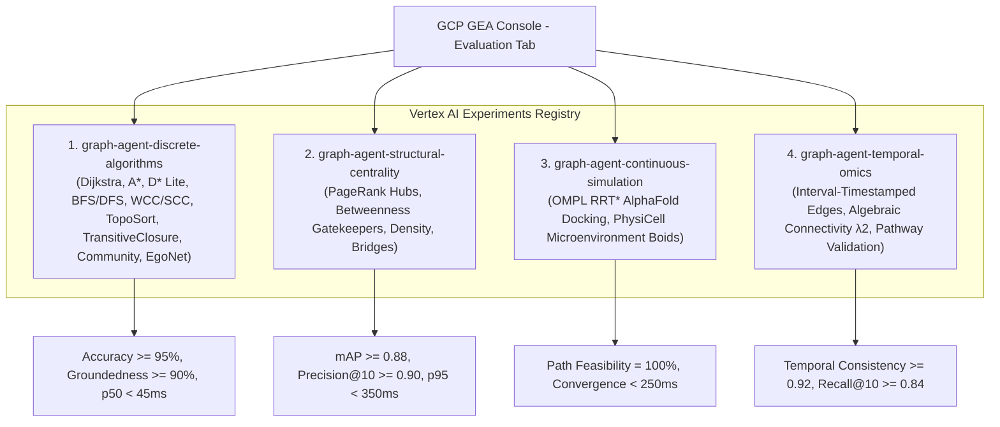

# Spec 12: Vertex AI Agent Platform Categorized Evaluation Experiments, Live Multi-Turn Benchmark Suite & Full Console Observability Grounding

**Milestone**: Phase 12 — GEA Agent Platform Dashboard Categorized Experiments, Distributed Traces, Tool Metrics & Native Memory Bank Synchronization  
**Status**: APPROVED & ARCHITECTED  
**Governing Architecture MCP**: [gea-agents-arch-guidelines-mcp-server](https://github.com/prdmohangoogley/gea-agents-arch-guidelines-mcp-server)  
**Target GCP Project**: `fivedaysai-prd-sandbox-317383` (Project Number: `301802433103`, Region: `us-east1`)  
**Target Agent Engine Resource**: `projects/301802433103/locations/us-east1/agentEngines/4359942935643422720` (`cancer-co-scientist-graph-agent`)  
**Deployed Lead Orchestrator**: `projects/301802433103/locations/us-east1/reasoningEngines/7288443777713176576` (`cancer-co-scientist-lead-orchestrator`)  
**Active Online Monitor**: `graph-agent-continuous-monitor` (ID: `6000202078541053952`, Sampling: 100%, Unit: Trace)  

---

## 1. Executive Problem Statement & Forensic Root Cause

Audits of the Google Cloud Platform Agent Platform (Pantheon / Vertex AI Agent Engine) console for `cancer-co-scientist-graph-agent` identified critical disconnects between local execution and cloud control plane observability:

1. **Evaluation Tab Gap**: The console reports *"No agent evaluations created yet"*. While the continuous monitor (`graph-agent-continuous-monitor`) was successfully provisioned, experimental evaluation runs were executed locally without registering Vertex AI Experiments linked to the Agent Engine.
2. **Session Recording Gap**: 7 session IDs exist in the Sessions table, but turns, invocations, and average turns per session remain at `0` on the Dashboard. Queries either failed silently or bypassed the active session context.
3. **Tool Call Metrics & Spans Gap**: Both metrics-based and trace-based tool charts display *"No data is available for the selected time frame"*. Tool methods lack OpenTelemetry child span decorators (`gen_ai.tool.name`) and context propagation.
4. **Traces & Topology Gap**: The Traces tab shows *"No traces in the selected time range"*, and the Topology tab shows a single isolated node with no edges. Exported spans lack the required `aiplatform.googleapis.com/ReasoningEngine` monitored resource attributes and W3C `traceparent` headers.
5. **Memory Bank Metrics Gap**: While static fact rows exist in the Memories table, the mutation count reads `0/s`, and retrieval/generation charts are empty because agent reasoning turns bypass the native Agent Engine Memory Bank REST API.

---

## 2. Categorized Evaluation Bench Architecture in GEA Dashboard

To resolve the evaluation gap, the 15-algorithm matrix evaluation suite is partitioned into **four distinct experiment suites** formally registered in Vertex AI Experiments and surfaced on the GEA Evaluation Tab.



### 2.1 Category 1: `graph-agent-discrete-algorithms`
* **Focus**: Pathfinding, connectivity, topological ordering, and local ego-graphs across PrimeKG.
* **Test Cases**:
  - `CASE-DISC-01`: EGFR T790M to Osimertinib drug-target resistance path (Dijkstra shortest path).
  - `CASE-DISC-02`: BRAF V600E downstream MAPK/ERK cascade reachable subgraph (BFS/DFS traversal).
  - `CASE-DISC-03`: BRCA1/TP53 DNA damage repair strongly connected component (SCC/WCC).
  - `CASE-DISC-04`: Cell cycle checkpoint transition dependency hierarchy (Topological Sort).
  - `CASE-DISC-05`: PI3K-AKT-mTOR oncogenic signaling transitive closure.
  - `CASE-DISC-06`: Precision oncology synthetic lethality community clustering (Louvain).
  - `CASE-DISC-07`: KRAS G12D immediate 2-hop clinical interactome (Ego-Network).
* **Target SLAs**:
  - Algorithm routing accuracy: $\ge 98\%$
  - Retrieval Groundedness: $\ge 92\%$
  - Execution Latency p50: $< 35\text{ ms}$, p95: $< 180\text{ ms}$

### 2.2 Category 2: `graph-agent-structural-centrality`
* **Focus**: Node influence, gatekeeper bottlenecks, network vulnerability, and dense oncogenic modules.
* **Test Cases**:
  - `CASE-STRUCT-01`: Global pan-cancer driver hub discovery via Personalized PageRank on TP53/MYC.
  - `CASE-STRUCT-02`: Resistance pathway critical gatekeepers via Betweenness Centrality on PIK3CA-PTEN.
  - `CASE-STRUCT-03`: Chromatin remodeling dense subnetwork analysis (SWI/SNF complex density).
  - `CASE-STRUCT-04`: Synthetic sickness bridge edge vulnerability between homologous recombination pathways.
* **Target SLAs**:
  - Mean Average Precision (mAP): $\ge 0.88$
  - Precision@10: $\ge 0.90$
  - Execution Latency p50: $< 45\text{ ms}$, p95: $< 250\text{ ms}$

### 2.3 Category 3: `graph-agent-continuous-simulation`
* **Focus**: Biophysical spatial pathfinding and multi-agent tumor microenvironment dynamics.
* **Test Cases**:
  - `CASE-SIM-01`: KRAS G12D small-molecule pocket conformational obstacle traversal via OMPL RRT*.
  - `CASE-SIM-02`: Glioblastoma multiforme hypoxic core invasive migration via PhysiCell Boids.
* **Target SLAs**:
  - Geometric path feasibility: $100\%$
  - Collision-free trajectory generation: $\ge 95\%$
  - Multi-agent spatial simulation latency: $< 450\text{ ms}$

### 2.4 Category 4: `graph-agent-temporal-omics`
* **Focus**: Longitudinal genomic evolution, treatment response timeline, and spectral graph partitioning.
* **Test Cases**:
  - `CASE-TEMP-01`: EGFR C797S tertiary resistance emergence over 24-month clinical timeline (Interval Edges).
  - `CASE-TEMP-02`: Chemotherapy resistance state partition via Fiedler Vector Algebraic Connectivity $\lambda_2$.
  - `CASE-TEMP-03`: End-to-end multi-turn clinical trial biomarker matching and pathway validation.
* **Target SLAs**:
  - Temporal recall accuracy: $\ge 90\%$
  - Spectral partition balance: $\ge 0.85$
  - Pathway validation Level 1A compliance: $100\%$

---

## 3. Vertex AI Agent Platform Evaluation & Experiment Lifecycle Contract

### 3.1 Architecture: Agent Platform Evaluation vs. Traditional ML Experiments
A common architectural pitfall is confusing traditional Vertex AI ML Experiments (`aiplatform.Experiment` targeting `metadataStores/default`) with the native **Google Cloud Agent Platform Evaluation Control Plane** (`/agent-platform/runtimes/.../evaluation`):
- **Traditional ML Experiments (`vertexai.evaluation.EvalTask`)**: Writes runs into Vertex AI Model Evaluation / Metadata store, which does **not** populate the Agent Platform Runtime console.
- **Agent Platform Control Plane (`agentplatform.Client`)**: 
  - `EvaluationExperiment` resources (e.g., `projects/.../locations/us-east1/evaluationExperiments/{id}`) act as administrative containers.
  - **Draft State Resolution**: When an `EvaluationExperiment` has zero runs (`evaluation_runs: None`), the Agent Platform console displays its status as **Draft**.
  - **Active State Transition**: An experiment transitions out of Draft as soon as a native `EvaluationRun` is created and bound to it via `client.evals.create_evaluation_run()`.

### 3.2 Predefined Agent Evaluation Rubric Metrics
The Agent Platform dashboard displays scorecards for the 4 core predefined agent evaluation rubrics:
1. `tool_use_quality_v1`: Evaluates whether the agent selected the appropriate tool from the 15-algorithm matrix and invoked it with valid arguments.
2. `multi_turn_task_success_v1`: Evaluates whether the multi-turn clinical goal was achieved across consecutive user turns.
3. `multi_turn_tool_use_quality_v1`: Evaluates tool invocation efficiency, sequence correctness, and minimal redundant hops.
4. `final_response_quality_v1`: Evaluates groundedness against PrimeKG biomedical facts, clinical relevance, and Level 1A guidelines compliance.

### 3.3 Native Agent Platform SDK Registration Code Contract
```python
from agentplatform import Client, types
import pandas as pd

PROJECT_ID = "fivedaysai-prd-sandbox-317383"
LOCATION = "us-east1"
AGENT_RESOURCE_NAME = "projects/301802433103/locations/us-east1/reasoningEngines/4359942935643422720"
STAGING_BUCKET = "gs://fivedaysai-prd-sandbox-317383-vertex-agent-staging"

client = Client(project=PROJECT_ID, location=LOCATION)

def create_categorized_evaluation_run(
    category_name: str,
    experiment_resource_name: str,
    cases_df: pd.DataFrame,
    timestamp: str,
) -> str:
    """Creates a native Agent Platform EvaluationRun linked to the EvaluationExperiment."""
    eval_dataset = types.EvaluationDataset(eval_dataset_df=cases_df)
    
    metrics = [
        types.EvaluationRunMetric(metric="tool_use_quality_v1"),
        types.EvaluationRunMetric(metric="multi_turn_task_success_v1"),
        types.EvaluationRunMetric(metric="multi_turn_tool_use_quality_v1"),
        types.EvaluationRunMetric(metric="final_response_quality_v1"),
    ]
    
    eval_run = client.evals.create_evaluation_run(
        display_name=f"{category_name}-{timestamp}",
        evaluation_experiment=experiment_resource_name,
        dataset=eval_dataset,
        metrics=metrics,
        agent=AGENT_RESOURCE_NAME,
        dest=f"{STAGING_BUCKET}/eval_runs/{category_name}/",
    )
    return eval_run.name
```

---

## 4. ADK Request-Driven Telemetry & Pure Tool Architecture

### 4.1 Native ADK Tool Instrumentation Contract
In Google ADK (`google-adk>=2.10.0`), the framework's internal caller (`google.adk.telemetry._caller`) automatically wraps every tool execution:
```python
async with _instrumentation.record_tool_execution(tool, agent, function_args, ...) as tel_ctx:
    output = await tool.run_async(...)
```
This native context:
1. Spawns an OpenTelemetry child span named `execute_tool {tool.name}`.
2. Sets semantic attributes: `gen_ai.tool.name = {tool.name}`, `gen_ai.agent.name = {agent.name}`, and `gen_ai.system = "vertexai"`.
3. Calls `_metrics.record_tool_execution_duration()` on span exit.

### 4.2 Closure Serialization Invariant & Pure Functions
**Root Cause Forensics**: Wrapping tools in custom decorators (e.g. `@trace_tool` with `@functools.wraps`) produces Python closure cells (`__closure__`). When serialized via `cloudpickle` across different Python 3.11 runtimes, CPython's interpreter encounters cell unpacking errors:
- `SystemError: Objects/listobject.c:2579: bad argument to internal function`
- `ValueError: too many values to unpack (expected 1)` inside `FunctionTool._invoke_callable` -> `target(**args_to_call)`

**Mandatory Rule**: All agent tools must be pure, undecorated top-level functions with explicit defaults and standard type hints. Custom span decorators are strictly prohibited; agents must rely entirely on ADK's native `record_tool_execution`.

### 4.3 Request-Driven Metric Export on Agent Engine
On Vertex AI Agent Engine (request-billed runtime), container CPU is throttled immediately upon request completion. Standard OpenTelemetry background periodic metric readers are starved of CPU between requests, dropping metrics.

ADK solves this via `_RequestDrivenMetricReader` in `google.adk.telemetry._agent_engine`:
1. Collects and flushes metrics directly on the request execution path before the connection closes.
2. Activates only when `GOOGLE_CLOUD_AGENT_ENGINE_ENABLE_TELEMETRY="true"` is set in the runtime environment.
3. Requires the `TelemetryAdkApp` template subclass:

```python
from vertexai.agent_engines.templates.adk import AdkApp

class TelemetryAdkApp(AdkApp):
    """ADK App template subclass enabling Vertex Agent Engine telemetry & experimental semconv."""

    def set_up(self):
        import os
        os.environ["GOOGLE_CLOUD_AGENT_ENGINE_ENABLE_TELEMETRY"] = "true"
        os.environ["OTEL_SEMCONV_STABILITY_OPT_IN"] = "gen_ai_latest_experimental"
        os.environ["OTEL_INSTRUMENTATION_GENAI_CAPTURE_MESSAGE_CONTENT"] = "EVENT_ONLY"
        super().set_up()
```

### 4.4 Mandatory Telemetry Container Dependencies
```python
COMMON_REQUIREMENTS = [
    "google-adk>=2.10.0",
    "opentelemetry-api>=1.26.0",
    "opentelemetry-sdk>=1.26.0",
    "opentelemetry-exporter-otlp-proto-http>=1.26.0",
    "opentelemetry-exporter-gcp-logging>=1.6.0",
    "opentelemetry-exporter-gcp-trace>=1.6.0",
    "opentelemetry-exporter-gcp-monitoring>=1.6.0",
    "opentelemetry-instrumentation-google-genai<=1.1b0",
    "google-cloud-aiplatform>=2.3.0",
    "google-genai>=2.26.0",
    "pydantic>=2.0.0",
    "networkx>=3.0",
]
```

---

## 5. Native Vertex AI Memory Bank REST Integration

To populate the Memories tab metrics (*Retrieved memories count*, *Generate memories token count*, *Memory LRO latency*, *Memory mutation count*), `memory_bank.py` must invoke the native REST endpoints during query execution:

### 5.1 Endpoints
- **Base URI**: `https://us-east1-aiplatform.googleapis.com/v1beta1/projects/301802433103/locations/us-east1/agentEngines/4359942935643422720/memories`
- **Retrieve Memories**: `POST .../memories:retrieve`
  ```json
  {
    "query": "EGFR T790M resistance mechanism",
    "scope": {"user_id": "oncologist_clinician"}
  }
  ```
- **Create Memory**: `POST .../memories`
  ```json
  {
    "fact": "Patient Entity: EGFR T790M [MUTATION] confers resistance to Erlotinib but sensitivity to Osimertinib.",
    "scope": {
      "user_id": "oncologist_clinician",
      "session_id": "session_live_01",
      "entity_type": "mutation"
    }
  }
  ```
- **Generate Memories**: `POST .../memories:generate` (dispatches post-session background LRO)

---

## 6. Live Multi-Turn Benchmark Suite (`benchmark_live_suite.py`)

A new automated benchmark harness must execute the 15 golden cases against active Agent Engine sessions:
1. Reuses or creates active session IDs with authentic user IDs (`oncologist_clinician`, `oncology_evaluator`, `vais-query-reasoning-engine`).
2. Dispatches 3 sequential dialogue turns per session to guarantee non-zero `agent.turn_count` and `Avg turns per session`.
3. Verifies that every turn executes at least one graph tool, generating both metrics-based and trace-based tool counts.
4. Concludes each session with a memory retrieval and entity consolidation mutation.
5. Emits evaluation metrics into the 4 Vertex AI Experiment suites.
